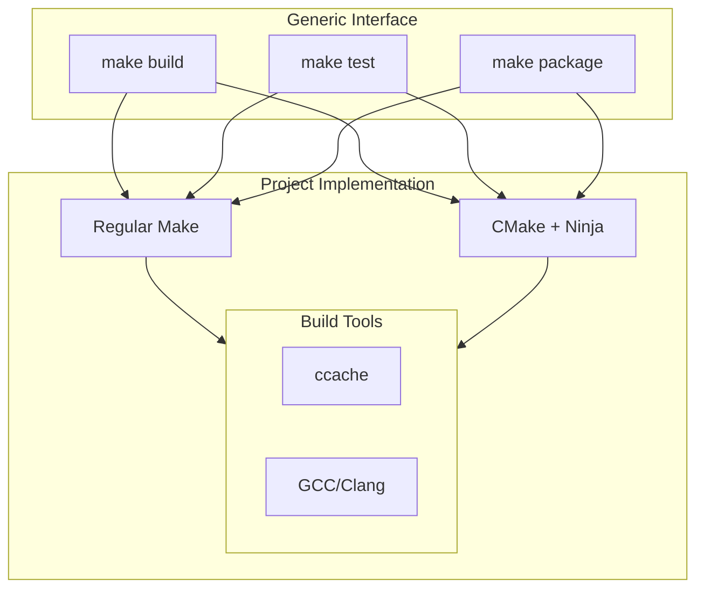

# C++ Build System Guide

## Overview

This guide covers two main approaches for C++ build systems:
1. Traditional Make builds (currently used in existing projects)
2. CMake builds (recommended for new projects)

Both approaches implement the standard make targets (build, test, package, deploy) while providing project-specific build logic.

## Build System Components



## Project Structures

### Make-Based Project
```
project/
├── Makefile              # Generic targets implementation
├── src/                  # Source files
├── include/             # Public headers
├── tests/               # Test files
├── build/               # Build output
└── dist/                # Distribution packages
```

### CMake-Based Project
```
project/
├── Makefile             # Generic targets implementation
├── CMakeLists.txt       # CMake configuration
├── src/                 # Source files
│   └── CMakeLists.txt  # Source build rules
├── include/            # Public headers
├── tests/              # Test files
│   └── CMakeLists.txt # Test build rules
├── build/              # Build output
└── dist/               # Distribution packages
```

## Make-Based Projects

### Example Makefile
```makefile
# Makefile for traditional Make build

.PHONY: build test package deploy clean

# Variables
CXX ?= g++
CXXFLAGS += -Wall -Wextra -std=c++17
BUILD_DIR ?= build
DIST_DIR ?= dist

# Source files
SRCS := $(wildcard src/*.cpp)
OBJS := $(SRCS:src/%.cpp=$(BUILD_DIR)/%.o)

# Targets
build: $(BUILD_DIR)/program

$(BUILD_DIR)/program: $(OBJS)
    $(CXX) $(OBJS) -o $@

$(BUILD_DIR)/%.o: src/%.cpp
    @mkdir -p $(BUILD_DIR)
    $(CXX) $(CXXFLAGS) -c $< -o $@

test:
    ./$(BUILD_DIR)/program --test

package:
    @mkdir -p $(DIST_DIR)
    tar -czf $(DIST_DIR)/program.tar.gz -C $(BUILD_DIR) program

deploy:
    # Implementation specific

clean:
    rm -rf $(BUILD_DIR) $(DIST_DIR)
```

## CMake-Based Projects

### Base CMakeLists.txt
```cmake
# Main CMakeLists.txt
cmake_minimum_required(VERSION 3.25)
project(YourProject VERSION 1.0.0)

# C++ standard
set(CMAKE_CXX_STANDARD 17)
set(CMAKE_CXX_STANDARD_REQUIRED ON)

# Build type
if(NOT CMAKE_BUILD_TYPE)
    set(CMAKE_BUILD_TYPE Release)
endif()

# Compiler options
add_compile_options(
    -Wall
    -Wextra
    -Wpedantic
)

# Enable testing
enable_testing()

# Add subdirectories
add_subdirectory(src)
add_subdirectory(tests)
```

### Example Makefile
```makefile
# Makefile for CMake project

.PHONY: build test package deploy clean

# Variables
BUILD_DIR ?= build
DIST_DIR ?= dist
BUILD_TYPE ?= Release
PARALLEL_JOBS ?= 4

# Targets
build:
    @mkdir -p $(BUILD_DIR)
    cd $(BUILD_DIR) && cmake -G Ninja \
        -DCMAKE_BUILD_TYPE=$(BUILD_TYPE) \
        -DCMAKE_EXPORT_COMPILE_COMMANDS=ON ..
    cmake --build $(BUILD_DIR) -j$(PARALLEL_JOBS)

test:
    cd $(BUILD_DIR) && ctest --output-on-failure

package:
    cd $(BUILD_DIR) && cpack

deploy:
    # Implementation specific

clean:
    rm -rf $(BUILD_DIR) $(DIST_DIR)
```

## Build Options

### Common Variables
```makefile
# Build configuration
BUILD_TYPE=Release    # Release or Debug
VERBOSE=1            # Enable verbose output
PARALLEL_JOBS=4      # Number of parallel jobs

# Compiler settings
CXX=g++             # or clang++
CXXFLAGS="-O2"      # Compiler flags
```

### CMake-Specific Options
```cmake
option(BUILD_TESTS "Build test suite" ON)
option(ENABLE_CCACHE "Enable ccache support" ON)
option(USE_BOOST "Enable Boost libraries" OFF)
```

## Docker Integration

Both build approaches use the same C++ Docker environment:

```dockerfile
# docker/cpp/Dockerfile
FROM base:latest

# Install C++ tools
RUN apt-get update && apt-get install -y \
    g++ \
    cmake \
    ninja-build \
    ccache
```

## Dependency Management

### System Dependencies
```bash
# Essential build tools
apt-get install -y \
    build-essential \
    cmake \
    ninja-build \
    ccache

# Optional libraries
apt-get install -y \
    libboost-all-dev \
    libgtest-dev
```

### CMake External Dependencies
```cmake
# Find external packages
find_package(Boost REQUIRED)
find_package(GTest REQUIRED)

# Link dependencies
target_link_libraries(${PROJECT_NAME}
    PRIVATE
        Boost::boost
        GTest::GTest
)
```

## Best Practices

### Build Configuration
- Enable ccache for both Make and CMake builds
- Use consistent compiler flags
- Set appropriate parallel jobs
- Implement all standard targets

### Make Projects
- Use explicit dependencies
- Maintain clear variable structure
- Handle subdirectories properly
- Support test frameworks

### CMake Projects
- Use modern CMake practices
- Apply target-based approach
- Handle dependencies properly
- Support proper testing

## Common Issues

### Build Problems
| Issue | Solution |
|-------|----------|
| Missing dependencies | Install required packages |
| Compiler errors | Check compiler version/flags |
| Link errors | Verify library paths |
| Cache misses | Clear ccache if needed |

### Performance Issues
- Enable parallel builds
- Use ccache effectively
- Optimize dependency builds
- Monitor resource usage

## Examples

### Basic Usage
```bash
# Regular build
make build

# Debug build
make build BUILD_TYPE=Debug

# Run tests
make test

# Create package
make package
```

### Testing Options
```bash
# Make project tests
make test TEST_ARGS="MyTestSuite"

# CMake project tests
make test CTEST_ARGS="--output-on-failure"
```

## See Also

- [Makefile Targets](makefile-targets.md)
- [Build System Overview](overview.md)
- [Docker Environment](../docker/cpp-environment.md)
