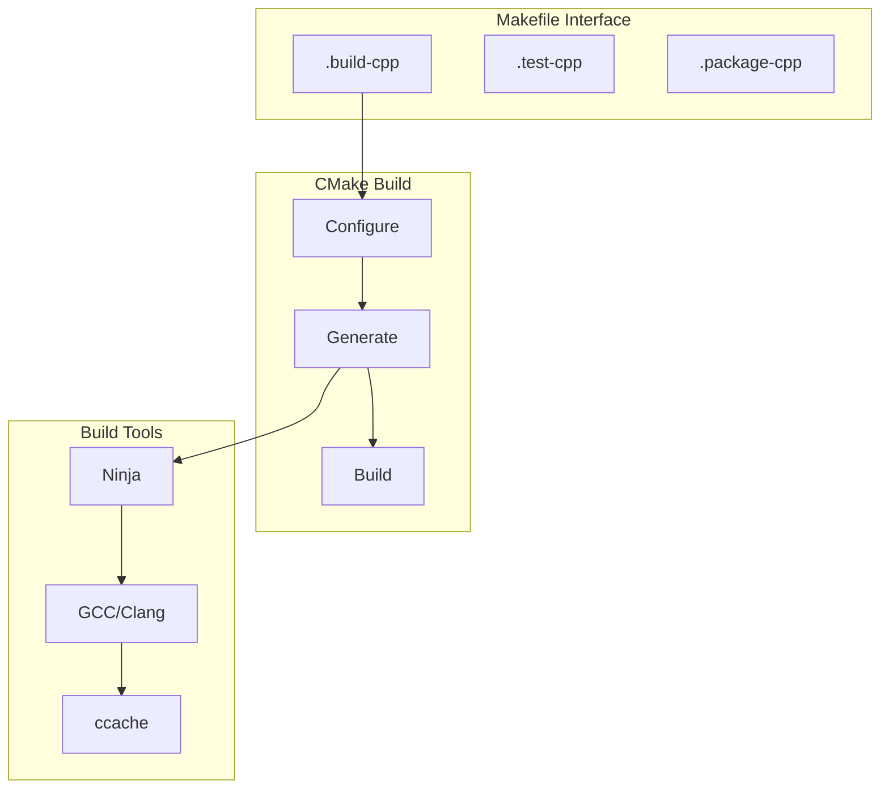

# C++ Build System Guide

## Overview

The C++ build system uses CMake with Ninja as the generator, providing fast, parallel builds with ccache integration for optimal performance. The system is containerized using Docker for consistent build environments.

## Build System Components



## Directory Structure

```
project/
├── CMakeLists.txt          # Main CMake configuration
├── src/                    # Source files
│   └── CMakeLists.txt     # Source build rules
├── include/               # Public headers
├── tests/                 # Test files
│   └── CMakeLists.txt    # Test build rules
├── build/                 # Build output
│   └── cpp/              # C++ specific output
└── dist/                 # Distribution packages
    └── cpp/              # C++ packages
```

## CMake Configuration

### Base Configuration
```cmake
# CMakeLists.txt
cmake_minimum_required(VERSION 3.25)
project(YourProject VERSION 1.0.0)

# C++ standard
set(CMAKE_CXX_STANDARD 17)
set(CMAKE_CXX_STANDARD_REQUIRED ON)

# Build type
if(NOT CMAKE_BUILD_TYPE)
    set(CMAKE_BUILD_TYPE Release)
endif()

# Compiler options
add_compile_options(
    -Wall
    -Wextra
    -Wpedantic
)

# Enable testing
enable_testing()
```

### Build Options
```cmake
option(BUILD_TESTS "Build test suite" ON)
option(ENABLE_CCACHE "Enable ccache support" ON)
option(USE_BOOST "Enable Boost libraries" OFF)
```

## Make Targets

### Primary Targets

| Target | Description | Dependencies |
|--------|-------------|--------------|
| `.build-cpp` | Build C++ components | `.cmake-init` |
| `.test-cpp` | Run C++ tests | `.build-cpp` |
| `.package-cpp` | Create packages | `.build-cpp` |
| `.clean-cpp` | Clean build artifacts | None |

### Helper Targets

| Target | Description | Usage |
|--------|-------------|-------|
| `.cmake-init` | Initialize CMake | `make .cmake-init` |
| `.docker-cpp-build` | Build Docker image | `make .docker-cpp-build` |

## Build Process

### 1. CMake Initialization
```bash
# Initialize CMake project
make .cmake-init

# With custom generator
make .cmake-init CMAKE_GENERATOR="Unix Makefiles"
```

### 2. Building
```bash
# Standard build
make .build-cpp

# Debug build
make .build-cpp BUILD_TYPE=Debug

# Parallel build
make .build-cpp -j4
```

### 3. Testing
```bash
# Run all tests
make .test-cpp

# Run with coverage
make .test-cpp COVERAGE=1

# Run specific test
make .test-cpp ARGS="--gtest_filter=TestSuite.TestCase"
```

## Docker Integration

### Build Environment
```dockerfile
# docker/cpp/Dockerfile
FROM base:latest

# Install C++ tools
RUN apt-get update && apt-get install -y \
    g++ \
    cmake \
    ninja-build \
    ccache
```

### Using Docker Build
```bash
# Build in container
make .build-cpp DOCKER=1

# Custom image
make .build-cpp DOCKER_IMAGE=custom/cpp:latest
```

## Configuration Options

### Build Variables
```makefile
# Build type
CMAKE_BUILD_TYPE=Release    # Release, Debug, RelWithDebInfo

# Generator
CMAKE_GENERATOR="Ninja"     # Ninja, "Unix Makefiles"

# Compiler
CXX=g++                    # g++, clang++

# Parallel jobs
PARALLEL_JOBS=4            # Number of parallel jobs
```

### Cache Configuration
```makefile
# Cache directory
CCACHE_DIR=.ccache

# Cache size
CCACHE_MAXSIZE=10G

# Cache compression
CCACHE_COMPRESS=1
```

## Dependency Management

### System Dependencies
```bash
# Install build dependencies
apt-get install -y \
    build-essential \
    cmake \
    ninja-build \
    ccache \
    libboost-all-dev
```

### External Dependencies
```cmake
# Find external packages
find_package(Boost REQUIRED)
find_package(GTest REQUIRED)

# Link dependencies
target_link_libraries(${PROJECT_NAME}
    PRIVATE
        Boost::boost
        GTest::GTest
)
```

## Best Practices

### Build Configuration
- Use Ninja generator for faster builds
- Enable ccache for compilation
- Set appropriate parallel jobs
- Use consistent build types

### CMake Style
- Modern CMake practices
- Target-based approach
- Clear dependency management
- Proper version requirements

### Testing
- Comprehensive test suite
- Coverage tracking
- Clear test organization
- Regular test execution

## Common Issues

### Build Errors
| Error | Cause | Solution |
|-------|-------|----------|
| CMake not found | Missing CMake | Install CMake |
| Compiler error | Wrong compiler version | Update compiler |
| Ninja error | Missing Ninja | Install Ninja |
| Cache miss | Invalid cache | Clear ccache |

### Performance Issues
- High build times
- Cache inefficiency
- Resource constraints
- Dependency problems

## Examples

### Basic Build
```bash
# Clean build
make .clean-cpp
make .build-cpp

# Debug build with coverage
make .build-cpp BUILD_TYPE=Debug COVERAGE=1
```

### Test Execution
```bash
# All tests
make .test-cpp

# Specific test suite
make .test-cpp ARGS="--gtest_filter=Math.*"
```

### Package Creation
```bash
# Create release package
make .package-cpp BUILD_TYPE=Release

# With version
make .package-cpp VERSION=1.0.0
```

## See Also

- [Makefile Targets](makefile-targets.md)
- [Build System Overview](overview.md)
- [Docker Environment](../docker/cpp-environment.md)
