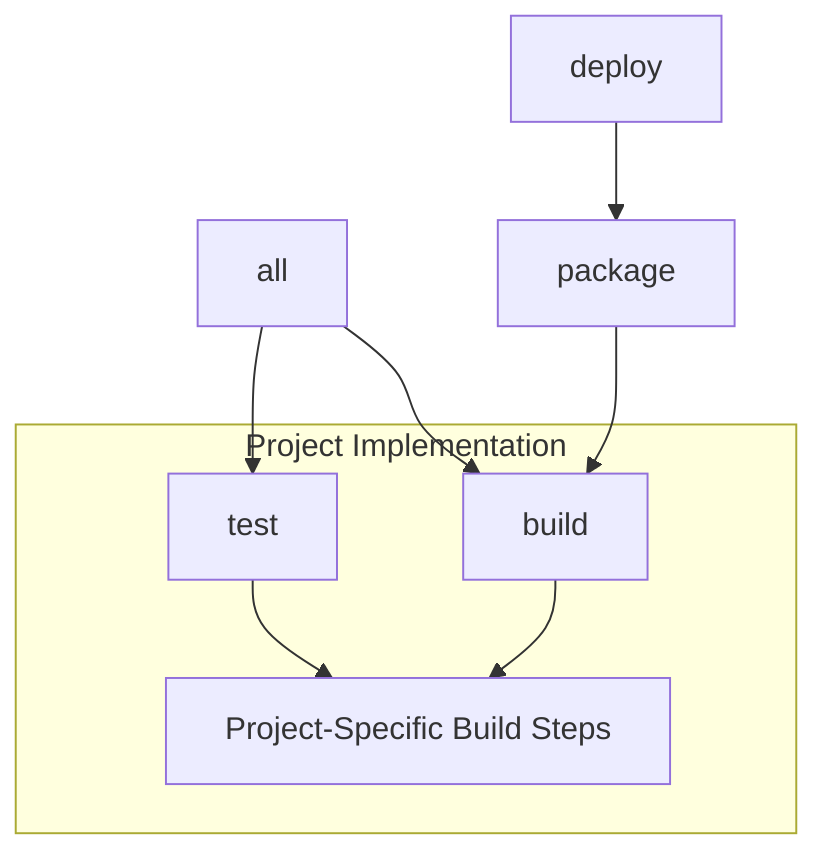

# Makefile Targets Reference

This document describes the standard make targets that all projects must implement, regardless of programming language. If you're migrating from the previous build system (using .build-cpp or .build-python targets), see the [Migration Guide](migration-guide.md).

## Standard Targets

These targets represent the common interface that all projects must implement, regardless of their programming language.

### Primary Targets

| Target | Description | Example |
|--------|-------------|---------|
| `all` | Default target, builds and tests | `make all` |
| `build` | Build the project | `make build` |
| `test` | Run project tests | `make test` |
| `package` | Create distribution package | `make package` |
| `deploy` | Deploy package | `make deploy` |
| `clean` | Remove build artifacts | `make clean` |

### Common Variables

```makefile
# Build configuration
BUILD_TYPE=Release    # Release or Debug
VERBOSE=1            # Enable verbose output
PARALLEL_JOBS=4      # Number of parallel jobs

# Example usage
make build BUILD_TYPE=Debug VERBOSE=1
```

## Project Type Examples

The following examples show how to implement the standard targets for different project types. For help migrating existing projects to this format, see the [Migration Guide](migration-guide.md).

### C++ Project Implementation

```makefile
# Example Makefile for C++ project with Make

.PHONY: build test package deploy clean

# Variables
CXX ?= g++
CXXFLAGS += -Wall -Wextra
BUILD_DIR ?= build
DIST_DIR ?= dist

# Targets
build:
    $(CXX) $(CXXFLAGS) src/*.cpp -o $(BUILD_DIR)/program

test:
    ./$(BUILD_DIR)/program --test

package:
    tar -czf $(DIST_DIR)/program.tar.gz $(BUILD_DIR)/program

deploy:
    # Deploy implementation

clean:
    rm -rf $(BUILD_DIR)/* $(DIST_DIR)/*
```

### CMake Project Implementation

```makefile
# Example Makefile for C++ project with CMake

.PHONY: build test package deploy clean

# Variables
BUILD_DIR ?= build
DIST_DIR ?= dist
BUILD_TYPE ?= Release

# Targets
build:
    mkdir -p $(BUILD_DIR)
    cd $(BUILD_DIR) && cmake -DCMAKE_BUILD_TYPE=$(BUILD_TYPE) ..
    cmake --build $(BUILD_DIR)

test:
    cd $(BUILD_DIR) && ctest --output-on-failure

package:
    cd $(BUILD_DIR) && cpack

deploy:
    # Deploy implementation

clean:
    rm -rf $(BUILD_DIR)/* $(DIST_DIR)/*
```

### Python Project Implementation (setup.py)

```makefile
# Example Makefile for Python 3.9 project

.PHONY: build test package deploy clean

# Variables
VENV ?= .venv
PYTHON ?= python3.9
BUILD_DIR ?= build
DIST_DIR ?= dist

# Targets
build:
    $(PYTHON) -m venv $(VENV)
    . $(VENV)/bin/activate && pip install -e .

test:
    . $(VENV)/bin/activate && pytest tests/

package:
    . $(VENV)/bin/activate && python setup.py sdist bdist_wheel

deploy:
    # Deploy implementation

clean:
    rm -rf $(BUILD_DIR)/* $(DIST_DIR)/* *.egg-info
```

### Python Project Implementation (pyproject.toml)

```makefile
# Example Makefile for Python 3.11+ project

.PHONY: build test package deploy clean

# Variables
VENV ?= .venv
PYTHON ?= python3.11
BUILD_DIR ?= build
DIST_DIR ?= dist

# Targets
build:
    $(PYTHON) -m venv $(VENV)
    . $(VENV)/bin/activate && pip install -e ".[dev]"

test:
    . $(VENV)/bin/activate && nox

package:
    . $(VENV)/bin/activate && python -m build

deploy:
    # Deploy implementation

clean:
    rm -rf $(BUILD_DIR)/* $(DIST_DIR)/* *.egg-info
```

## Target Dependencies



## Options and Arguments

### Build Options

```makefile
# Common build options
BUILD_TYPE=Release    # Build type (Release/Debug)
VERBOSE=1            # Verbose output
PARALLEL_JOBS=4      # Parallel jobs

# C++ specific
CXXFLAGS="-Wall"     # Compiler flags
CMAKE_ARGS=""        # CMake arguments

# Python specific
PYTEST_ARGS=""       # pytest arguments
NOX_SESSION=""       # nox session name
```

## Error Handling

### Common Error Messages

| Error | Possible Cause | Solution |
|-------|---------------|----------|
| `make: *** No rule to make target` | Missing target implementation | Add target to Makefile |
| `command not found` | Missing tool or wrong PATH | Install required tool |
| `permission denied` | File permissions issue | Check file permissions |

### Debug Options

```makefile
# Print all commands
make VERBOSE=1

# Debug specific target
make --debug=basic target-name

# Print dependency tree
make --print-data-base
```

## Best Practices

### Target Implementation
- Implement all standard targets
- Use consistent variable names
- Document target behavior
- Handle errors gracefully

### Variable Usage
- Provide sensible defaults
- Use ?= for overridable variables
- Document all variables
- Keep project-specific variables local

### Dependencies
- Declare all dependencies explicitly
- Use order-only prerequisites where appropriate
- Minimize unnecessary rebuilds

## Examples

### Basic Usage
```bash
# Full build cycle
make clean build test

# Debug build
make build BUILD_TYPE=Debug

# Release package
make package BUILD_TYPE=Release
```

### Testing Options
```bash
# C++ project with specific test filter
make test TEST_FILTER="MyTest*"

# Python project with pytest args
make test PYTEST_ARGS="-k test_feature"

# Python project with specific nox session
make test NOX_SESSION="tests"
```

### CI/CD Usage
```bash
# Typical CI pipeline sequence
make build && make test && make package
```

## See Also

- [Build System Overview](overview.md)
- [Migration Guide](migration-guide.md) - For transitioning from language-specific targets
- [C++ Build Guide](cpp-builds.md) - Detailed C++ implementation examples
- [Python Build Guide](python-builds.md) - Detailed Python implementation examples
- [Docker Configuration](../docker/base-image.md)
