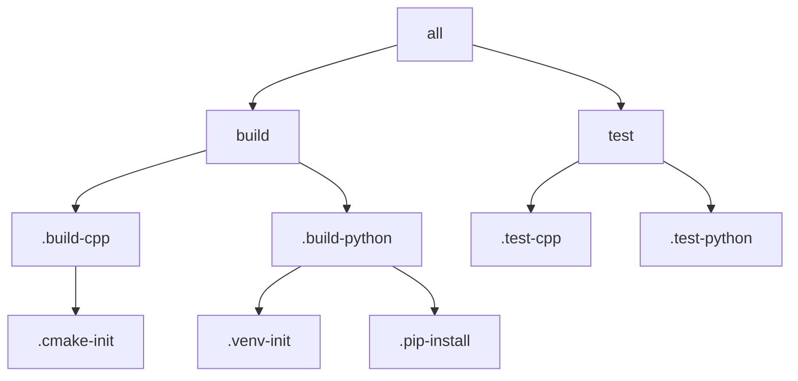

# Makefile Targets Reference

## Standard Targets

These targets are available in the root Makefile and provide a language-agnostic interface for build operations.

### Primary Targets

| Target | Description | Dependencies | Example |
|--------|-------------|--------------|---------|
| `all` | Default target, builds and tests | `build test` | `make all` |
| `build` | Build all language components | `.build-cpp .build-python` | `make build` |
| `test` | Run all tests | `.test-cpp .test-python` | `make test` |
| `package` | Create distribution packages | `.package-cpp .package-python` | `make package` |
| `deploy` | Deploy packages | `.deploy-cpp .deploy-python` | `make deploy` |
| `clean` | Remove all build artifacts | `.clean-cpp .clean-python` | `make clean` |

### Options and Variables

```makefile
# Build configuration
BUILD_TYPE=Release    # Release or Debug
VERBOSE=1            # Enable verbose output
PARALLEL_JOBS=4      # Number of parallel jobs

# Example usage
make build BUILD_TYPE=Debug VERBOSE=1
```

## C++ Targets

### Build Targets

| Target | Description | Usage |
|--------|-------------|-------|
| `.build-cpp` | Build C++ components | `make .build-cpp` |
| `.test-cpp` | Run C++ tests | `make .test-cpp` |
| `.package-cpp` | Package C++ artifacts | `make .package-cpp` |
| `.deploy-cpp` | Deploy C++ packages | `make .deploy-cpp` |
| `.clean-cpp` | Clean C++ artifacts | `make .clean-cpp` |
| `.cmake-init` | Initialize CMake project | `make .cmake-init` |

### C++ Options

```makefile
# CMake configuration
CMAKE_BUILD_TYPE=Release    # Build type
CMAKE_GENERATOR="Ninja"     # Build system generator
CCACHE_DIR=.ccache         # Compiler cache directory

# Example usage
make .build-cpp CMAKE_BUILD_TYPE=Debug
```

## Python Targets

### Build Targets

| Target | Description | Usage |
|--------|-------------|-------|
| `.build-python` | Build Python components | `make .build-python` |
| `.test-python` | Run Python tests | `make .test-python` |
| `.package-python` | Package Python artifacts | `make .package-python` |
| `.deploy-python` | Deploy Python packages | `make .deploy-python` |
| `.clean-python` | Clean Python artifacts | `make .clean-python` |
| `.venv-init` | Initialize virtual environment | `make .venv-init` |
| `.pip-install` | Install Python dependencies | `make .pip-install` |

### Python Options

```makefile
# Python configuration
VIRTUAL_ENV=.venv          # Virtual environment path
PYTHONPATH=$(PWD)         # Python path
PYTEST_ARGS="-v"          # Pytest arguments

# Example usage
make .test-python PYTEST_ARGS="-v --cov"
```

## Docker Targets

### Build Targets

| Target | Description | Usage |
|--------|-------------|-------|
| `.docker-cpp-build` | Build C++ Docker image | `make .docker-cpp-build` |
| `.docker-python-build` | Build Python Docker image | `make .docker-python-build` |

### Docker Options

```makefile
# Docker configuration
DOCKER_REGISTRY=your-registry.com   # Registry URL
DOCKER_TAG=latest                   # Image tag

# Example usage
make .docker-cpp-build DOCKER_TAG=1.0.0
```

## Advanced Usage

### Parallel Execution

```bash
# Build all targets in parallel
make -j4 build

# Run specific language builds in parallel
make -j2 .build-cpp .build-python
```

### Conditional Execution

```bash
# Build only if source files changed
make -B build

# Build specific target if dependencies changed
make --question .build-cpp || make .build-cpp
```

### Target Dependencies



## Error Handling

### Common Error Messages

| Error | Possible Cause | Solution |
|-------|---------------|----------|
| `make: *** No rule to make target` | Missing include or target | Check makefile includes |
| `command not found` | Missing tool or wrong PATH | Install required tool |
| `permission denied` | File permissions issue | Check file permissions |

### Debug Options

```makefile
# Print all commands
make VERBOSE=1

# Debug specific target
make --debug=basic target-name

# Print dependency tree
make --print-data-base
```

## Best Practices

### Target Naming
- Use standard targets for common operations
- Prefix internal targets with dot (.)
- Use descriptive names for custom targets

### Variable Usage
- Provide defaults for all variables
- Use ?= for overridable variables
- Document all variables

### Dependencies
- Declare all dependencies explicitly
- Use order-only prerequisites where appropriate
- Minimize unnecessary rebuilds

## Examples

### Basic Build
```bash
# Full build
make clean build test

# Debug build
make build BUILD_TYPE=Debug

# Release package
make package BUILD_TYPE=Release
```

### Language-Specific
```bash
# C++ development
make .cmake-init
make .build-cpp
make .test-cpp

# Python development
make .venv-init
make .pip-install
make .test-python
```

### Docker Integration
```bash
# Build all images
make .docker-cpp-build
make .docker-python-build

# Run in container
make .build-cpp DOCKER=1
```

## See Also

- [Build System Overview](overview.md)
- [C++ Build Guide](cpp-builds.md)
- [Python Build Guide](python-builds.md)
- [Docker Configuration](../docker/base-image.md)
