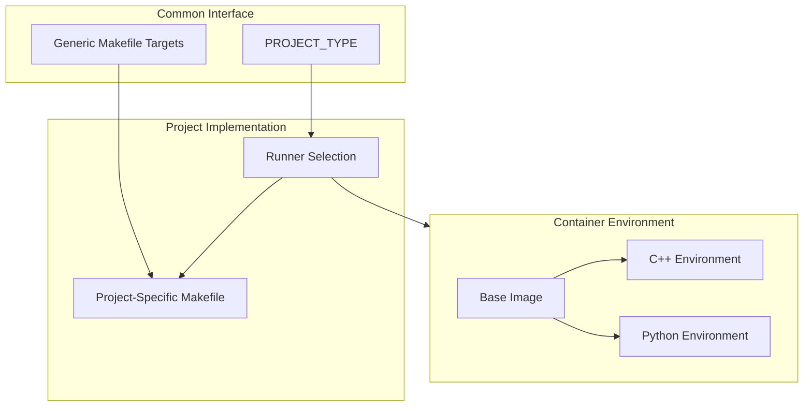
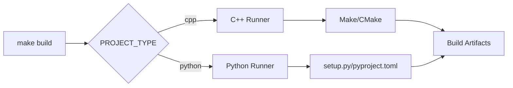
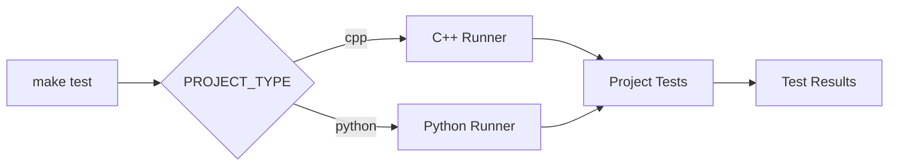

# Build System Overview

## Architecture

The build system uses generic make targets that standardize build operations across different programming languages, with project-specific implementations. This architecture enables consistent build, test, package, and deployment processes regardless of the underlying technology. For projects migrating from the previous build system, see the [Migration Guide](migration-guide.md).



## Core Components

### 1. Project Makefile
- Implements standardized targets (build, test, etc.)
- Contains project-specific build logic
- Manages environment setup
- Handles dependencies

For example implementations, see [C++ Builds](cpp-builds.md) or [Python Builds](python-builds.md).

### 2. Project Type Configuration
- Specified in .gitlab-ci.yml
- Determines runner selection
- Configures build environment
- Sets up tool chain

See [Job Templates](../ci-cd/job-templates.md) for CI/CD configuration examples.

### 3. Runner Selection
- base: Common development tools
- cpp: C++ development environment
- python: Python development environment

For runner configuration details, see [Pipeline Overview](../ci-cd/pipeline-overview.md#runner-configuration).

### 4. Docker Integration
- Containerized build environments
- Consistent toolchain versions
- Isolated dependencies
- Cross-platform compatibility

See [Docker Environment](../docker/base-image.md) for container configuration details.

## Standard Targets

### Build Process


For detailed target documentation, see [Makefile Targets](makefile-targets.md).

### Test Process


## Environment Management

### Project Structure
```
project/
├── Makefile           # Project-specific implementation
├── .gitlab-ci.yml     # CI/CD and project type configuration
├── build/            # Build artifacts
└── dist/             # Distribution packages
```

### Environment Variables
```bash
BUILD_DIR="build"              # Build output location
DIST_DIR="dist"               # Distribution packages
BUILD_TYPE="Release"          # Build configuration
PARALLEL_JOBS="4"            # Parallel execution
```

For caching configuration, see [Caching Strategy](../ci-cd/caching-strategy.md).

## Implementation Details

### 1. Build Process
- Runner selection via PROJECT_TYPE
- Tool and dependency verification
- Build environment preparation
- Artifact generation

### 2. Test Execution
- Test environment setup
- Test runner configuration
- Coverage reporting
- Results collection

### 3. Package Creation
- Artifact collection
- Version management
- Package generation
- Distribution preparation

### 4. Deployment
- Environment validation
- Package verification
- Deployment execution
- Status reporting

For parallel execution strategies, see [Parallel Execution](../ci-cd/parallel-execution.md).

## Extension Points

### New Project Setup
1. Create project Makefile implementing standard targets
2. Specify PROJECT_TYPE in .gitlab-ci.yml
3. Configure build environment
4. Add project documentation

For migration from existing projects, see the [Migration Guide](migration-guide.md).

### Project Customization
1. Override default variables
2. Add custom targets
3. Extend standard targets
4. Configure environment

## Best Practices

### Project Structure
- Implement all standard targets (build, test, etc.)
- Keep build logic in Makefile
- Set PROJECT_TYPE in .gitlab-ci.yml
- Document build requirements

### Language-Specific Practices

#### C++ Projects
- Support both Make and CMake builds
- Use ccache for compilation
- Implement clear test structure
- Handle dependencies consistently

For detailed C++ guidelines, see [C++ Builds](cpp-builds.md).

#### Python Projects
- Support both setup.py (3.9) and pyproject.toml (3.11+)
- Use virtual environments
- Implement nox for newer projects
- Manage dependencies effectively

For detailed Python guidelines, see [Python Builds](python-builds.md).

### Docker Usage
- Use provided runners
- Keep local builds clean
- Follow runner documentation
- Handle dependencies efficiently

## Performance Considerations

### Build Optimization
- Parallel job execution
- Efficient dependency management
- Cache utilization
- Resource allocation

For detailed caching strategies, see [Caching Strategy](../ci-cd/caching-strategy.md).

### Common Issues
- Missing dependencies
- Environment conflicts
- Path issues
- Permission problems

For troubleshooting help, see [Build Problems](../troubleshooting/build-problems.md).

## Next Steps

1. Review [Makefile Targets](makefile-targets.md)
2. Explore language-specific guides:
   - [C++ Builds](cpp-builds.md)
   - [Python Builds](python-builds.md)
3. Learn about [Docker environments](../docker/base-image.md)
4. If migrating, follow the [Migration Guide](migration-guide.md)

## Additional Resources

- [Getting Started Guide](../getting-started/getting-started.md)
- [Troubleshooting](../troubleshooting/build-problems.md)
- [Migration Guide](migration-guide.md)
