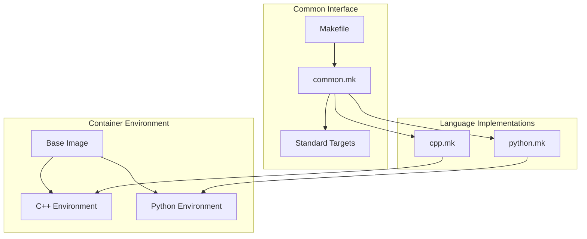
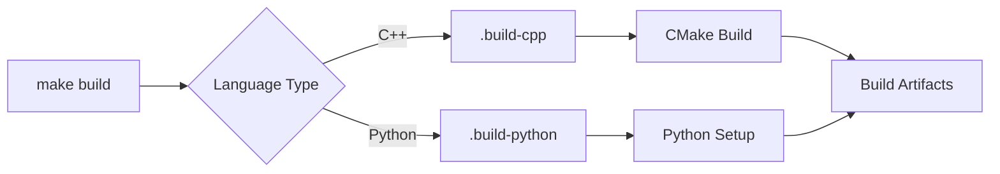
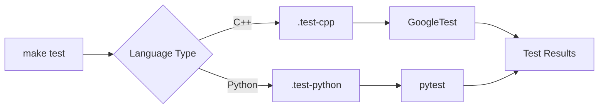

# Build System Overview

## Architecture

The build system is designed around a language-agnostic interface that standardizes build operations across different programming languages. This architecture enables consistent build, test, package, and deployment processes regardless of the underlying technology.



## Core Components

### 1. Main Makefile
- Provides standardized top-level targets
- Includes language-specific implementations
- Manages build orchestration
- Handles environment setup

### 2. Common Utilities (common.mk)
- Shared functions and variables
- Environment detection
- Directory management
- Logging and error handling

### 3. Language-Specific Makefiles
- Implement standard targets for each language
- Handle language-specific build tools
- Manage dependencies
- Configure test environments

### 4. Docker Integration
- Containerized build environments
- Consistent toolchain versions
- Isolated dependencies
- Cross-platform compatibility

## Standard Targets

### Build Process


### Test Process


## Environment Management

### Directory Structure
```
project/
├── Makefile           # Main interface
├── make/
│   ├── common.mk     # Shared utilities
│   ├── cpp.mk        # C++ implementation
│   └── python.mk     # Python implementation
├── build/            # Build artifacts
│   ├── cpp/
│   └── python/
└── dist/             # Distribution packages
    ├── cpp/
    └── python/
```

### Environment Variables
```bash
BUILD_DIR="build"              # Build output location
DIST_DIR="dist"               # Distribution packages
BUILD_TYPE="Release"          # Build configuration
PARALLEL_JOBS="4"            # Parallel execution
```

## Implementation Details

### 1. Build Process
- Language detection and validation
- Tool and dependency verification
- Build environment preparation
- Artifact generation

### 2. Test Execution
- Test environment setup
- Test runner configuration
- Coverage reporting
- Results collection

### 3. Package Creation
- Artifact collection
- Version management
- Package generation
- Distribution preparation

### 4. Deployment
- Environment validation
- Package verification
- Deployment execution
- Status reporting

## Extension Points

### Adding New Languages
1. Create language-specific makefile
2. Implement standard targets
3. Add Docker environment
4. Update documentation

### Customizing Builds
1. Override default variables
2. Add custom targets
3. Extend existing targets
4. Configure environment

## Best Practices

### Build System Usage
- Use language-specific targets when possible
- Leverage parallel builds
- Maintain clean dependencies
- Follow naming conventions

### Docker Integration
- Use provided base images
- Maintain minimal images
- Optimize layer caching
- Handle dependencies efficiently

### Environment Configuration
- Set required variables
- Use consistent paths
- Manage tool versions
- Document overrides

## Performance Considerations

### Build Optimization
- Parallel job execution
- Efficient dependency management
- Cache utilization
- Resource allocation

### Common Issues
- Missing dependencies
- Environment conflicts
- Path issues
- Permission problems

## Next Steps

1. Review [Makefile Targets](makefile-targets.md)
2. Explore language-specific guides:
   - [C++ Builds](cpp-builds.md)
   - [Python Builds](python-builds.md)
3. Learn about [Docker environments](../docker/base-image.md)

## Additional Resources

- [Installation Guide](../getting-started/installation.md)
- [Quick Start Guide](../getting-started/quickstart.md)
- [Troubleshooting](../troubleshooting/build-problems.md)
