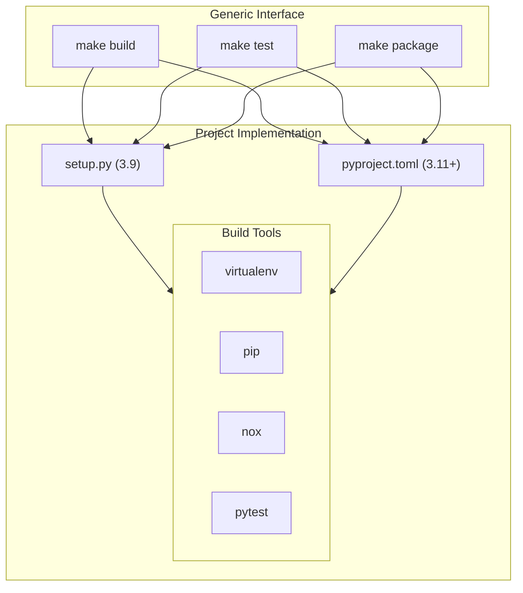

# Python Build System Guide

## Overview

This guide covers two main approaches for Python projects:
1. Python 3.9 with setup.py (current projects)
2. Python 3.11+ with pyproject.toml and nox (new projects)

Both approaches implement the standard make targets (build, test, package, deploy) while providing project-specific build logic.

## Build System Components



## Project Structures

### Python 3.9 Project (setup.py)
```
project/
├── Makefile             # Generic targets implementation
├── setup.py             # Package configuration
├── requirements.txt     # Dependencies
├── src/                # Source code
│   └── your_package/
│       ├── __init__.py
│       └── module.py
├── tests/              # Test files
│   ├── __init__.py
│   └── test_module.py
└── dist/               # Distribution packages
```

### Python 3.11+ Project (pyproject.toml)
```
project/
├── Makefile            # Generic targets implementation
├── pyproject.toml      # Project configuration
├── src/               # Source code
│   └── your_package/
│       ├── __init__.py
│       └── module.py
├── tests/             # Test files
│   ├── __init__.py
│   └── test_module.py
└── dist/              # Distribution packages
```

## Python 3.9 Projects (setup.py)

### Example Makefile
```makefile
# Makefile for Python 3.9 project

.PHONY: build test package deploy clean

# Variables
VENV ?= .venv
PYTHON ?= python3.9
PYTEST_ARGS ?= -v

# Targets
build:
    $(PYTHON) -m venv $(VENV)
    . $(VENV)/bin/activate && pip install -e .

test:
    . $(VENV)/bin/activate && pytest $(PYTEST_ARGS) tests/

package:
    . $(VENV)/bin/activate && python setup.py sdist bdist_wheel

deploy:
    # Implementation specific

clean:
    rm -rf build/ dist/ *.egg-info/ $(VENV)/
```

### setup.py Configuration
```python
from setuptools import setup, find_packages

setup(
    name="your-package",
    version="1.0.0",
    packages=find_packages(where="src"),
    package_dir={"": "src"},
    install_requires=[
        "dependency>=1.0.0",
    ],
    extras_require={
        "dev": [
            "pytest>=7.0.0",
            "black>=22.0.0",
        ],
    },
)
```

## Python 3.11+ Projects (pyproject.toml)

### Example Makefile
```makefile
# Makefile for Python 3.11+ project

.PHONY: build test package deploy clean

# Variables
VENV ?= .venv
PYTHON ?= python3.11
NOX_SESSION ?= tests

# Targets
build:
    $(PYTHON) -m venv $(VENV)
    . $(VENV)/bin/activate && pip install -e ".[dev]"

test:
    . $(VENV)/bin/activate && nox -s $(NOX_SESSION)

package:
    . $(VENV)/bin/activate && python -m build

deploy:
    # Implementation specific

clean:
    rm -rf build/ dist/ *.egg-info/ $(VENV)/ .nox/
```

### pyproject.toml Configuration
```toml
[project]
name = "your-package"
version = "1.0.0"
dependencies = [
    "dependency>=1.0.0",
]

[project.optional-dependencies]
dev = [
    "pytest>=7.0.0",
    "black>=22.0.0",
    "nox>=2023.4.22",
]

[build-system]
requires = ["hatchling"]
build-backend = "hatchling.build"
```

### noxfile.py Configuration
```python
import nox

@nox.session
def tests(session):
    session.install(".[dev]")
    session.run("pytest", "tests/")

@nox.session
def lint(session):
    session.install(".[dev]")
    session.run("black", "src/", "tests/")
```

## Docker Integration

Both approaches use the same base Python Docker environment:

```dockerfile
# docker/python/Dockerfile
FROM base:latest

# Install Python
RUN apt-get update && apt-get install -y \
    python3.9 \
    python3.9-venv \
    python3.11 \
    python3.11-venv \
    python3-pip
```

## Build Options

### Common Variables
```makefile
# Environment configuration
VENV=.venv               # Virtual environment path
PYTHONPATH=src           # Python path
VERBOSE=1                # Verbose output

# Test configuration
COVERAGE=0               # Enable coverage
PARALLEL=auto            # Parallel test execution
```

### Testing Options
```bash
# Python 3.9 project
make test PYTEST_ARGS="-v --cov=src"

# Python 3.11+ project
make test NOX_SESSION="tests-with-coverage"
```

## Best Practices

### Environment Management
- Always use virtual environments
- Pin dependency versions
- Separate dev dependencies
- Keep dependencies updated

### Python 3.9 Projects
- Use setup.py for configuration
- Maintain requirements.txt
- Use pytest for testing
- Implement coverage tracking

### Python 3.11+ Projects
- Use pyproject.toml
- Implement nox sessions
- Leverage modern packaging tools
- Use type hints

### Testing
- Write comprehensive tests
- Use fixtures effectively
- Mock external services
- Maintain test isolation

## Common Issues

### Build Problems
| Issue | Solution |
|-------|----------|
| Venv creation fails | Check Python installation |
| Dependency conflicts | Update requirements |
| Import errors | Verify PYTHONPATH |
| Test failures | Debug test cases |

### Performance Issues
- Use parallel test execution
- Optimize test fixtures
- Cache pip downloads
- Monitor resource usage

## Examples

### Basic Usage
```bash
# Regular build
make build

# Run tests
make test

# Create package
make package
```

### Advanced Testing
```bash
# Python 3.9 with coverage
make test PYTEST_ARGS="-v --cov=src"

# Python 3.11+ specific session
make test NOX_SESSION="integration-tests"
```

## See Also

- [Makefile Targets](makefile-targets.md)
- [Build System Overview](overview.md)
- [Docker Environment](../docker/python-environment.md)
