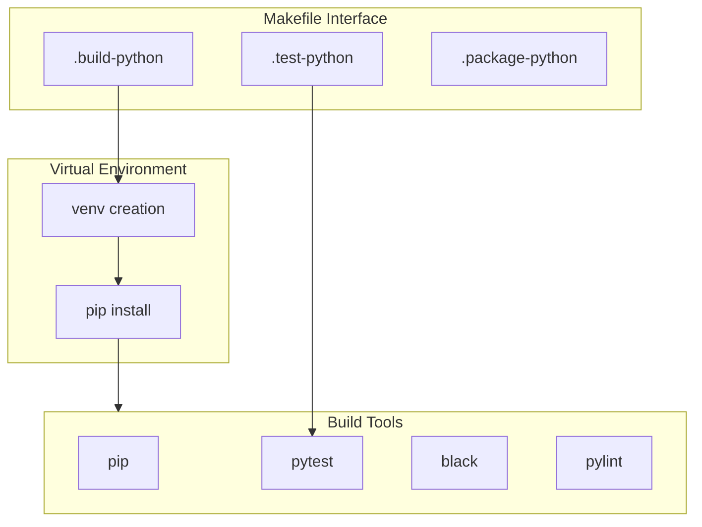

# Python Build System Guide

## Overview

The Python build system provides a standardized way to manage Python projects, handling virtual environments, dependencies, testing, and packaging. It integrates with Docker to ensure consistent development and build environments.

## Build System Components



## Directory Structure

```
project/
├── setup.py              # Package configuration
├── requirements.txt      # Dependencies
├── src/                  # Source code
│   └── your_package/
│       ├── __init__.py
│       └── module.py
├── tests/               # Test files
│   ├── __init__.py
│   └── test_module.py
├── build/              # Build output
│   └── python/        # Python specific output
└── dist/              # Distribution packages
    └── python/        # Python packages
```

## Python Environment

### Virtual Environment
```bash
# Environment location
VIRTUAL_ENV=.venv

# Python version
PYTHON_VERSION=3.9

# Path configuration
PYTHONPATH=${PWD}/src
```

### Dependencies Configuration
```ini
# requirements.txt
pytest>=7.0.0
black>=22.0.0
pylint>=2.12.0
coverage>=6.0.0
```

## Make Targets

### Primary Targets

| Target | Description | Dependencies |
|--------|-------------|--------------|
| `.build-python` | Build Python package | `.venv-init .pip-install` |
| `.test-python` | Run Python tests | `.build-python` |
| `.package-python` | Create distribution | `.build-python` |
| `.clean-python` | Clean build artifacts | None |

### Helper Targets

| Target | Description | Usage |
|--------|-------------|-------|
| `.venv-init` | Create virtual environment | `make .venv-init` |
| `.pip-install` | Install dependencies | `make .pip-install` |
| `.docker-python-build` | Build Docker image | `make .docker-python-build` |

## Build Process

### 1. Environment Setup
```bash
# Initialize virtual environment
make .venv-init

# Install dependencies
make .pip-install

# With development dependencies
make .pip-install DEV=1
```

### 2. Building
```bash
# Standard build
make .build-python

# Development mode
make .build-python DEV=1

# With specific Python version
make .build-python PYTHON_VERSION=3.8
```

### 3. Testing
```bash
# Run all tests
make .test-python

# With coverage
make .test-python COVERAGE=1

# Specific test file
make .test-python ARGS="tests/test_specific.py"
```

## Docker Integration

### Build Environment
```dockerfile
# docker/python/Dockerfile
FROM base:latest

# Install Python tools
RUN apt-get update && apt-get install -y \
    python3.9 \
    python3.9-venv \
    python3-pip
```

### Using Docker Build
```bash
# Build in container
make .build-python DOCKER=1

# Custom image
make .build-python DOCKER_IMAGE=custom/python:latest
```

## Configuration Options

### Build Variables
```makefile
# Python version
PYTHON_VERSION=3.9

# Virtual environment
VIRTUAL_ENV=.venv

# Package name
PACKAGE_NAME=your-package

# Development mode
DEV=0  # Set to 1 for development install
```

### Test Configuration
```makefile
# Test arguments
PYTEST_ARGS="-v"

# Coverage settings
COVERAGE=0
COVERAGE_ARGS="--cov=src"

# Linting
LINT=1
LINT_ARGS="--rcfile=setup.cfg"
```

## Package Management

### setup.py Configuration
```python
from setuptools import setup, find_packages

setup(
    name="your-package",
    version="1.0.0",
    packages=find_packages(where="src"),
    package_dir={"": "src"},
    install_requires=[
        "dependency>=1.0.0",
    ],
    extras_require={
        "dev": [
            "pytest>=7.0.0",
            "black>=22.0.0",
        ],
    },
)
```

### Development Dependencies
```bash
# Install dev dependencies
make .pip-install DEV=1

# Update dependencies
make .pip-install UPDATE=1
```

## Best Practices

### Environment Management
- Use virtual environments
- Pin dependency versions
- Separate dev dependencies
- Keep requirements updated

### Code Quality
- Run linters
- Format code
- Check types
- Generate coverage

### Testing
- Write comprehensive tests
- Use fixtures
- Mock external services
- Maintain test isolation

## Common Issues

### Build Errors
| Error | Cause | Solution |
|-------|-------|----------|
| venv not found | Python missing | Install Python |
| pip install fails | Network/Permission | Check connection/permissions |
| Import error | PYTHONPATH wrong | Set correct PYTHONPATH |
| Test failure | Code/Test issue | Debug test case |

### Environment Issues
- Virtual environment problems
- Dependency conflicts
- Path configuration
- Python version mismatch

## Examples

### Basic Development
```bash
# Setup development environment
make .venv-init
make .pip-install DEV=1

# Run tests with coverage
make .test-python COVERAGE=1
```

### Package Building
```bash
# Build distribution package
make .package-python

# Build with specific version
make .package-python VERSION=1.0.0
```

### Quality Checks
```bash
# Run linting
make .test-python LINT=1

# Format code
make .build-python FORMAT=1
```

## See Also

- [Makefile Targets](makefile-targets.md)
- [Build System Overview](overview.md)
- [Docker Environment](../docker/python-environment.md)
