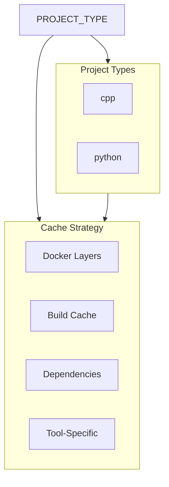
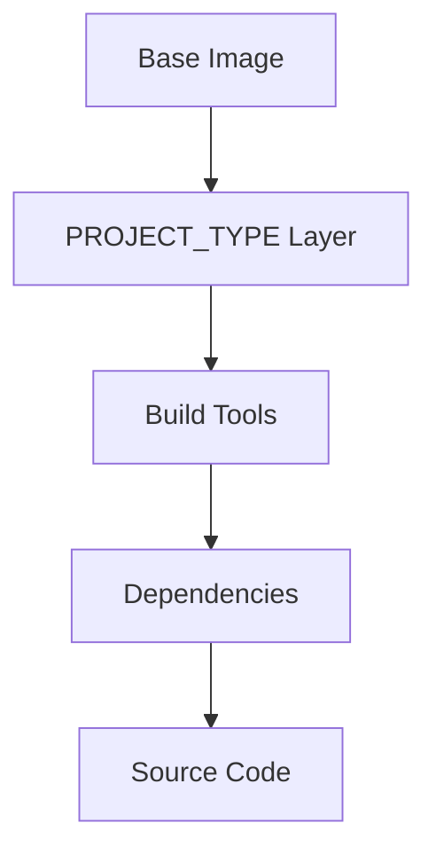

# Caching Strategy

## Overview

Effective caching is crucial for pipeline performance. This guide covers caching strategies based on project type, including Docker layers, build artifacts, dependencies, and compiler outputs.



## Cache Types

### GitLab CI Cache
```yaml
cache:
  key: ${CI_COMMIT_REF_SLUG}-${PROJECT_TYPE}
  paths:
    - build/
    - dist/
    # Project-specific paths
    - .ccache/     # For C++ projects
    - .venv/       # For Python projects
  policy: pull-push
```

### Docker Layer Caching
```dockerfile
# Optimize layer caching
FROM base:latest
ARG PROJECT_TYPE

# Project-specific installations
RUN if [ "$PROJECT_TYPE" = "cpp" ]; then \
        apt-get install -y build-essential cmake; \
    elif [ "$PROJECT_TYPE" = "python" ]; then \
        apt-get install -y python3-venv; \
    fi
```

### Build Cache
```yaml
variables:
  # C++ projects
  CCACHE_DIR: ${CI_PROJECT_DIR}/.ccache
  CCACHE_MAXSIZE: "1G"
  
  # Python projects
  PIP_CACHE_DIR: ${CI_PROJECT_DIR}/.pip-cache
```

## Cache Configuration

### Cache Keys
```yaml
# Project-type based key
cache:
  key: ${PROJECT_TYPE}-${CI_COMMIT_REF_SLUG}

# File-based key with project type
cache:
  key:
    files:
      - Makefile
      # Project-specific files
      - CMakeLists.txt      # For C++ projects
      - pyproject.toml      # For Python projects
    prefix: ${PROJECT_TYPE}

# Complex key
cache:
  key: ${PROJECT_TYPE}-${CI_COMMIT_REF_SLUG}-${CI_JOB_NAME}
```

### Cache Policies
```yaml
# Pull-only cache
cache:
  policy: pull

# Push-only cache (for cache warming)
cache:
  policy: push

# Standard pull-push cache
cache:
  policy: pull-push
```

## Project-Specific Caching

### C++ Project Cache
```yaml
variables:
  PROJECT_TYPE: cpp

cache:
  key: cpp-${CI_COMMIT_REF_SLUG}
  paths:
    - build/
    - dist/
    - .ccache/
  policy: pull-push
  variables:
    CCACHE_DIR: ${CI_PROJECT_DIR}/.ccache
```

### Python Project Cache
```yaml
variables:
  PROJECT_TYPE: python

cache:
  key: python-${CI_COMMIT_REF_SLUG}
  paths:
    - build/
    - dist/
    - .venv/
    - .pip-cache/
  policy: pull-push
  variables:
    PIP_CACHE_DIR: ${CI_PROJECT_DIR}/.pip-cache
```

## Optimization Techniques

### Layer Optimization


### Cache Warming
```yaml
# Warm up cache job
cache:warm:
  stage: .pre
  script:
    - |
      if [ "$PROJECT_TYPE" = "cpp" ]; then
        mkdir -p .ccache
      elif [ "$PROJECT_TYPE" = "python" ]; then
        mkdir -p .venv .pip-cache
      fi
  cache:
    policy: push
```

### Fallback Caching
```yaml
cache:
  - key: ${PROJECT_TYPE}-${CI_COMMIT_REF_SLUG}
    paths: [.cache/]
  - key: ${PROJECT_TYPE}-default
    paths: [.cache/]
    policy: pull
```

## Best Practices

### Cache Organization
- Use PROJECT_TYPE in cache keys
- Separate build and dependency caches
- Set appropriate retention policies
- Implement regular cleanup

### Performance Optimization
- Optimize cache sizes
- Use appropriate paths
- Enable compression
- Monitor cache effectiveness

### Maintenance
- Regular cache pruning
- Version tracking
- Space monitoring
- Hit rate analysis

## Docker Caching

### Registry Caching
```yaml
docker-build:
  variables:
    DOCKER_BUILDKIT: "1"
  script:
    - docker build --build-arg PROJECT_TYPE=${PROJECT_TYPE} 
      --cache-from $CI_REGISTRY_IMAGE/${PROJECT_TYPE}:latest .
```

### BuildKit Cache
```dockerfile
# syntax=docker/dockerfile:1.4
FROM base AS builder
ARG PROJECT_TYPE

RUN --mount=type=cache,target=/root/.cache \
    if [ "$PROJECT_TYPE" = "python" ]; then \
        --mount=type=cache,target=/root/.cache/pip pip install ...; \
    fi
```

## Build Caching

### Tool-Specific Cache
```yaml
.tool_cache:
  cache:
    key: ${PROJECT_TYPE}-tools
    paths:
      # C++ tools
      - .ccache/
      # Python tools
      - .pip-cache/
      - __pycache__/
```

### Build Artifacts
```yaml
.build_cache:
  cache:
    key: ${PROJECT_TYPE}-build
    paths:
      - build/
      - dist/
    policy: pull-push
```

## Troubleshooting

### Common Issues
| Issue | Cause | Solution |
|-------|-------|----------|
| Wrong cache | Invalid PROJECT_TYPE | Verify PROJECT_TYPE |
| Cache miss | Invalid key | Check key generation |
| Cache corruption | Partial upload | Clear cache |
| Space issues | Large cache | Set size limits |

### Debug Tools
```yaml
.cache_debug:
  before_script:
    - |
      if [ "$PROJECT_TYPE" = "cpp" ]; then
        ls -la .ccache/
        ccache -s
      elif [ "$PROJECT_TYPE" = "python" ]; then
        ls -la .venv/
        pip cache info
      fi
```

## Monitoring

### Cache Statistics
```yaml
.cache_stats:
  after_script:
    - |
      case $PROJECT_TYPE in
        cpp)
          ccache -s
          du -sh .ccache/
          ;;
        python)
          du -sh .venv/
          pip cache info
          ;;
      esac
```

### Performance Metrics
```yaml
.cache_metrics:
  variables:
    CI_DEBUG_TRACE: "true"
  after_script:
    - echo "Cache size: $(du -sh .cache/)"
```

## Examples

### Multi-Cache Strategy
```yaml
.multi_cache:
  cache:
    - key: ${PROJECT_TYPE}-${CI_COMMIT_REF_SLUG}-tools
      paths:
        - .ccache/    # For C++
        - .venv/      # For Python
      policy: pull-push
    - key: ${PROJECT_TYPE}-${CI_COMMIT_REF_SLUG}-build
      paths:
        - build/
        - dist/
      policy: pull-push
```

### Cache Cleanup
```yaml
cache:cleanup:
  script:
    - |
      case $PROJECT_TYPE in
        cpp)
          rm -rf .ccache/*
          ;;
        python)
          rm -rf .venv/* .pip-cache/*
          ;;
      esac
  cache:
    policy: push
  rules:
    - if: $CI_PIPELINE_SOURCE == "schedule"
```

## See Also

- [Pipeline Overview](pipeline-overview.md)
- [Job Templates](job-templates.md)
- [Parallel Execution](parallel-execution.md)
