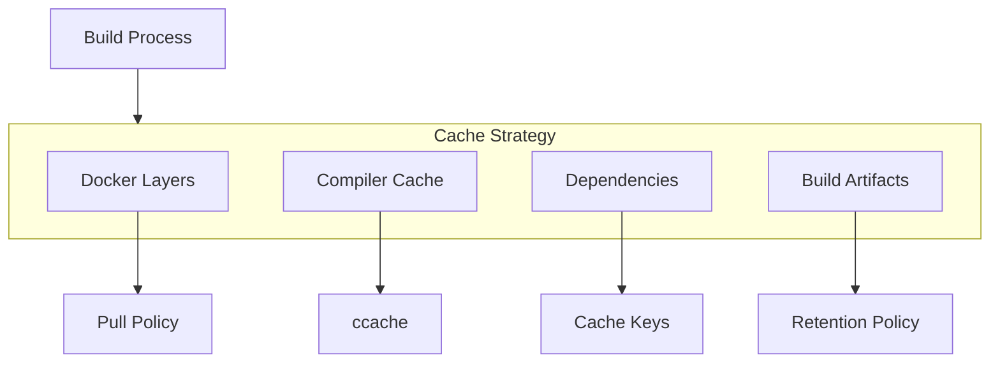
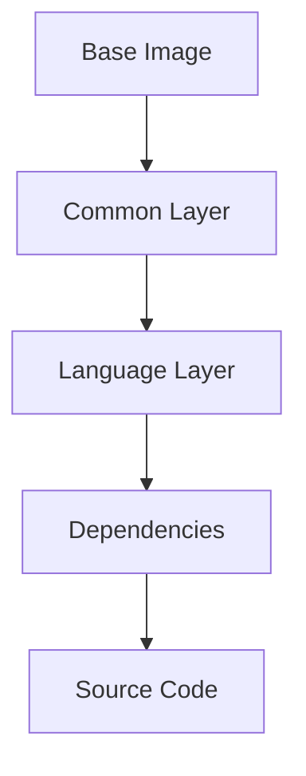

# Caching Strategy

## Overview

Effective caching is crucial for pipeline performance. This guide covers different caching strategies for Docker layers, build artifacts, dependencies, and compiler outputs.



## Cache Types

### GitLab CI Cache
```yaml
cache:
  key: ${CI_COMMIT_REF_SLUG}
  paths:
    - build/
    - .ccache/
    - .venv/
  policy: pull-push
```

### Docker Layer Caching
```dockerfile
# Optimize layer caching
FROM base:latest
COPY requirements.txt .
RUN pip install -r requirements.txt
COPY . .
```

### Compiler Cache
```yaml
variables:
  CCACHE_DIR: ${CI_PROJECT_DIR}/.ccache
  CCACHE_MAXSIZE: "1G"
```

## Cache Configuration

### Cache Keys
```yaml
# Simple key
cache:
  key: ${CI_COMMIT_REF_SLUG}

# File-based key
cache:
  key:
    files:
      - Makefile
      - cmake/
      - requirements.txt

# Complex key
cache:
  key: ${CI_COMMIT_REF_SLUG}-${CI_JOB_NAME}
```

### Cache Policies
```yaml
# Pull-only cache
cache:
  policy: pull

# Push-only cache
cache:
  policy: push

# Pull-push cache
cache:
  policy: pull-push
```

## Language-Specific Caching

### C++ Cache Strategy
```yaml
.cpp_cache:
  cache:
    key: cpp-${CI_COMMIT_REF_SLUG}
    paths:
      - build/cpp/
      - .ccache/
      - cmake/
    policy: pull-push
  variables:
    CCACHE_DIR: ${CI_PROJECT_DIR}/.ccache
```

### Python Cache Strategy
```yaml
.python_cache:
  cache:
    key: python-${CI_COMMIT_REF_SLUG}
    paths:
      - .venv/
      - pip-cache/
      - __pycache__/
    policy: pull-push
  variables:
    PIP_CACHE_DIR: ${CI_PROJECT_DIR}/pip-cache
```

## Optimization Techniques

### Layer Optimization


### Cache Warming
```yaml
# Warm up cache job
cache:warm:
  stage: .pre
  script:
    - mkdir -p .ccache
    - mkdir -p .venv
  cache:
    policy: push
```

### Fallback Caching
```yaml
cache:
  - key: ${CI_COMMIT_REF_SLUG}
    paths: [.cache/]
  - key: default-cache
    paths: [.cache/]
    policy: pull
```

## Best Practices

### Cache Organization
- Separate caches by language
- Use meaningful cache keys
- Set appropriate policies
- Regular cache cleanup

### Performance Optimization
- Minimize cache size
- Optimize paths
- Use compression
- Monitor cache hits

### Maintenance
- Regular pruning
- Version tracking
- Space monitoring
- Hit rate analysis

## Docker Caching

### Registry Caching
```yaml
docker-build:
  variables:
    DOCKER_BUILDKIT: "1"
  script:
    - docker build --cache-from $CI_REGISTRY_IMAGE:latest .
```

### BuildKit Cache
```dockerfile
# syntax=docker/dockerfile:1.4
FROM base AS builder
RUN --mount=type=cache,target=/root/.cache/pip pip install ...
```

## Dependency Caching

### Package Management
```yaml
# NPM cache
cache:
  paths:
    - .npm/

# Pip cache
cache:
  paths:
    - .pip-cache/

# Gradle cache
cache:
  paths:
    - .gradle/
```

### Vendor Directories
```yaml
cache:
  paths:
    - vendor/
    - node_modules/
    - .venv/
```

## Build Caching

### Compiler Cache
```yaml
.ccache_config:
  variables:
    CCACHE_DIR: ${CI_PROJECT_DIR}/.ccache
    CCACHE_MAXSIZE: "1G"
    CCACHE_COMPRESS: "true"
  cache:
    paths:
      - .ccache/
```

### Build Artifacts
```yaml
.build_cache:
  cache:
    paths:
      - build/
      - dist/
    policy: pull-push
```

## Troubleshooting

### Common Issues
| Issue | Cause | Solution |
|-------|-------|----------|
| Cache miss | Invalid key | Check key generation |
| Cache corruption | Partial upload | Clear cache |
| Space issues | Large cache | Set size limits |
| Slow cache | Network/Size | Optimize paths |

### Debug Tools
```yaml
.cache_debug:
  before_script:
    - ls -la .ccache/
    - ccache -s
    - du -sh .venv/
```

## Monitoring

### Cache Statistics
```yaml
.cache_stats:
  after_script:
    - ccache -s
    - du -sh .ccache/
    - du -sh .venv/
```

### Performance Metrics
```yaml
.cache_metrics:
  variables:
    CI_DEBUG_TRACE: "true"
  after_script:
    - echo "Cache size: $(du -sh .cache/)"
```

## Examples

### Complex Cache Strategy
```yaml
.multi_cache:
  cache:
    - key: 
        files:
          - Makefile
          - CMakeLists.txt
      paths:
        - build/
        - .ccache/
      policy: pull-push
    - key: ${CI_COMMIT_REF_SLUG}
      paths:
        - .venv/
        - pip-cache/
      policy: pull-push
```

### Cache Cleanup
```yaml
cache:cleanup:
  script:
    - rm -rf .ccache/*
    - rm -rf .venv/*
  cache:
    policy: push
  rules:
    - if: $CI_PIPELINE_SOURCE == "schedule"
```

## See Also

- [Pipeline Overview](pipeline-overview.md)
- [Job Templates](job-templates.md)
- [Parallel Execution](parallel-execution.md)
