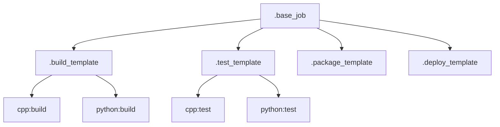

# GitLab CI/CD Job Templates

## Overview

Job templates provide reusable job configurations that can be extended and customized for specific use cases. They help maintain consistency across jobs and reduce configuration duplication.

## Base Templates

### Common Job Template
```yaml
# .gitlab/ci/base.gitlab-ci.yml
.base_job:
  image: $CI_REGISTRY_IMAGE/base:latest
  interruptible: true
  cache: &global_cache
    paths:
      - build/
      - .ccache/
      - .venv/
    policy: pull-push
```

### Stage Templates


## Build Templates

### Build Configuration
```yaml
.build_template:
  extends: .base_job
  stage: build
  artifacts:
    paths:
      - build/
      - dist/
    expire_in: 1 week
```

### Language-Specific Builds

#### C++ Build
```yaml
.cpp_build_template:
  extends: .build_template
  image: $CI_REGISTRY_IMAGE/cpp:latest
  variables:
    CMAKE_BUILD_TYPE: Release
  before_script:
    - mkdir -p build/cpp
  script:
    - make .build-cpp
```

#### Python Build
```yaml
.python_build_template:
  extends: .build_template
  image: $CI_REGISTRY_IMAGE/python:latest
  variables:
    VIRTUAL_ENV: $CI_PROJECT_DIR/.venv
  before_script:
    - python -m venv $VIRTUAL_ENV
    - source $VIRTUAL_ENV/bin/activate
  script:
    - make .build-python
```

## Test Templates

### Test Configuration
```yaml
.test_template:
  extends: .base_job
  stage: test
  coverage: '/TOTAL.+ ([0-9]{1,3}%)/'
  artifacts:
    reports:
      coverage_report:
        coverage_format: cobertura
        path: coverage.xml
      junit: test-results.xml
```

### Language-Specific Tests

#### C++ Tests
```yaml
.cpp_test_template:
  extends: .test_template
  image: $CI_REGISTRY_IMAGE/cpp:latest
  variables:
    GTEST_COLOR: "1"
  script:
    - make .test-cpp
  coverage: '/lines:\s+(\d+\.\d+\%)/'
```

#### Python Tests
```yaml
.python_test_template:
  extends: .test_template
  image: $CI_REGISTRY_IMAGE/python:latest
  variables:
    PYTEST_ADDOPTS: "--color=yes"
  script:
    - make .test-python
  coverage: '/TOTAL.+ ([0-9]{1,3}%)/'
```

## Package Templates

### Package Configuration
```yaml
.package_template:
  extends: .base_job
  stage: package
  artifacts:
    paths:
      - dist/
    expire_in: 1 month
```

### Language-Specific Packaging

#### C++ Package
```yaml
.cpp_package_template:
  extends: .package_template
  image: $CI_REGISTRY_IMAGE/cpp:latest
  script:
    - make .package-cpp
```

#### Python Package
```yaml
.python_package_template:
  extends: .package_template
  image: $CI_REGISTRY_IMAGE/python:latest
  script:
    - make .package-python
```

## Deploy Templates

### Deploy Configuration
```yaml
.deploy_template:
  extends: .base_job
  stage: deploy
  rules:
    - if: $CI_COMMIT_TAG
      when: on_success
    - when: manual
  environment:
    name: production
```

### Environment-Specific Deployment

#### Staging Deploy
```yaml
.deploy_staging_template:
  extends: .deploy_template
  environment:
    name: staging
  rules:
    - if: $CI_COMMIT_BRANCH == "develop"
      when: on_success
```

#### Production Deploy
```yaml
.deploy_production_template:
  extends: .deploy_template
  environment:
    name: production
  rules:
    - if: $CI_COMMIT_TAG
      when: manual
```

## Using Templates

### Basic Extension
```yaml
cpp:build:
  extends: .cpp_build_template
  variables:
    CMAKE_BUILD_TYPE: Debug

python:test:
  extends: .python_test_template
  variables:
    PYTEST_ADDOPTS: "-v --cov"
```

### Multiple Extensions
```yaml
cpp:deploy:staging:
  extends:
    - .cpp_package_template
    - .deploy_staging_template
```

## Template Customization

### Variables
```yaml
.custom_template:
  variables:
    BASE_VAR: "default"
  script:
    - echo $BASE_VAR

custom:job:
  extends: .custom_template
  variables:
    BASE_VAR: "override"
```

### Scripts
```yaml
.script_template:
  before_script:
    - echo "Template before script"
  script:
    - echo "Template main script"
  after_script:
    - echo "Template after script"

custom:job:
  extends: .script_template
  script:
    - echo "Custom main script"
```

## Best Practices

### Template Design
- Keep templates focused
- Use meaningful names
- Document variables
- Provide defaults

### Extension
- Extend appropriately
- Override carefully
- Document changes
- Maintain consistency

### Maintenance
- Regular updates
- Version control
- Clear documentation
- Test changes

## Common Patterns

### Matrix Jobs
```yaml
.matrix_template:
  parallel:
    matrix:
      - VARIABLE: [value1, value2]

matrix:job:
  extends: .matrix_template
  script:
    - echo $VARIABLE
```

### Conditional Jobs
```yaml
.conditional_template:
  rules:
    - if: $CI_COMMIT_BRANCH == "main"
      when: always
    - when: never
```

## Troubleshooting

### Common Issues
| Issue | Cause | Solution |
|-------|-------|----------|
| Template not found | Wrong path | Check include path |
| Variable undefined | Missing definition | Define in variables |
| Script override fails | Wrong syntax | Check YAML format |

### Debug Tips
```yaml
.debug_template:
  before_script:
    - env | sort
    - pwd
    - ls -la
```

## See Also

- [Pipeline Overview](pipeline-overview.md)
- [Parallel Execution](parallel-execution.md)
- [Caching Strategy](caching-strategy.md)
