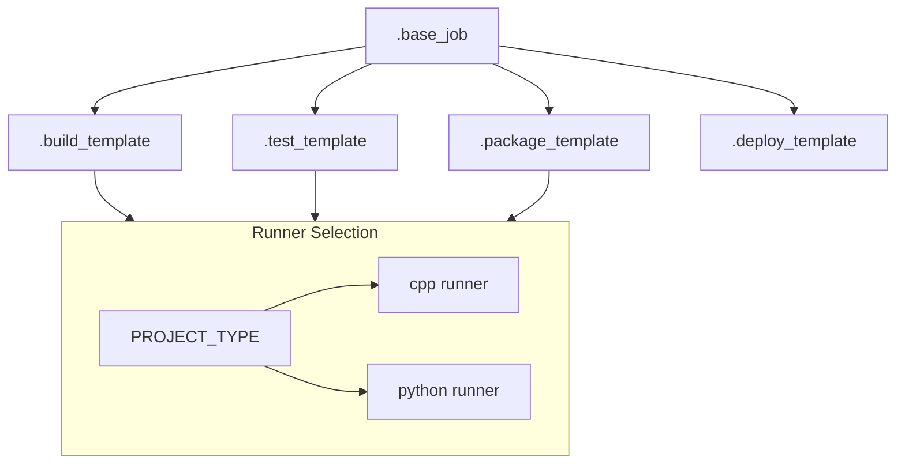

# GitLab CI/CD Job Templates

## Overview

Job templates provide reusable job configurations that can be extended and customized for specific use cases. The system uses PROJECT_TYPE to determine the appropriate runner and environment for each job.

## Base Templates

### Common Job Template
```yaml
# .gitlab/ci/base.gitlab-ci.yml
.base_job:
  image: $CI_REGISTRY_IMAGE/$PROJECT_TYPE:latest
  interruptible: true
  cache: &global_cache
    paths:
      - build/
      - dist/
    policy: pull-push
  tags:
    - $PROJECT_TYPE  # Automatically selects appropriate runner
```

### Stage Templates


## Build Templates

### Build Configuration
```yaml
.build_template:
  extends: .base_job
  stage: build
  script:
    - make build
  artifacts:
    paths:
      - build/
      - dist/
    expire_in: 1 week
```

### Environment-Specific Variables

#### C++ Environment
```yaml
# Set in .gitlab-ci.yml
variables:
  PROJECT_TYPE: cpp
  BUILD_TYPE: Release
  CCACHE_DIR: .ccache
```

#### Python Environment
```yaml
# Set in .gitlab-ci.yml
variables:
  PROJECT_TYPE: python
  VIRTUAL_ENV: .venv
  PYTHONPATH: src
```

## Test Templates

### Test Configuration
```yaml
.test_template:
  extends: .base_job
  stage: test
  script:
    - make test
  coverage: '/TOTAL.+ ([0-9]{1,3}%)/'
  artifacts:
    reports:
      coverage_report:
        coverage_format: cobertura
        path: coverage.xml
      junit: test-results.xml
```

### Test Arguments

#### C++ Test Options
```yaml
test:
  extends: .test_template
  variables:
    TEST_ARGS: "--gtest_filter=TestSuite.*"
```

#### Python Test Options
```yaml
test:
  extends: .test_template
  variables:
    PYTEST_ARGS: "-v --cov=src"
    NOX_SESSION: "tests"  # For Python 3.11+ projects
```

## Package Templates

### Package Configuration
```yaml
.package_template:
  extends: .base_job
  stage: package
  script:
    - make package
  artifacts:
    paths:
      - dist/
    expire_in: 1 month
```

## Deploy Templates

### Deploy Configuration
```yaml
.deploy_template:
  extends: .base_job
  stage: deploy
  script:
    - make deploy
  rules:
    - if: $CI_COMMIT_TAG
      when: on_success
    - when: manual
  environment:
    name: production
```

### Environment-Specific Deployment

#### Staging Deploy
```yaml
.deploy_staging_template:
  extends: .deploy_template
  environment:
    name: staging
  rules:
    - if: $CI_COMMIT_BRANCH == "develop"
      when: on_success
```

#### Production Deploy
```yaml
.deploy_production_template:
  extends: .deploy_template
  environment:
    name: production
  rules:
    - if: $CI_COMMIT_TAG
      when: manual
```

## Using Templates

### Basic Project Setup
```yaml
# .gitlab-ci.yml
include:
  - local: .gitlab/ci/base.gitlab-ci.yml

variables:
  PROJECT_TYPE: cpp  # or 'python'

# Standard jobs using templates
build:
  extends: .build_template

test:
  extends: .test_template

package:
  extends: .package_template
```

### Custom Configuration
```yaml
# Custom build job
build:
  extends: .build_template
  variables:
    BUILD_TYPE: Debug  # For C++ projects
    PARALLEL_JOBS: 4
```

## Template Customization

### Variables
```yaml
.custom_template:
  variables:
    BASE_VAR: "default"
  script:
    - echo $BASE_VAR

custom:job:
  extends: .custom_template
  variables:
    BASE_VAR: "override"
```

### Scripts
```yaml
.script_template:
  before_script:
    - echo "Template before script"
  script:
    - echo "Template main script"
  after_script:
    - echo "Template after script"

custom:job:
  extends: .script_template
  script:
    - echo "Custom main script"
```

## Best Practices

### Template Design
- Use PROJECT_TYPE for runner selection
- Keep templates generic
- Provide clear defaults
- Document variables

### Project Configuration
- Set PROJECT_TYPE explicitly
- Use appropriate runners
- Configure environment variables
- Handle artifacts properly

### Maintenance
- Regular updates
- Version control
- Clear documentation
- Test changes

## Common Patterns

### Matrix Jobs
```yaml
.matrix_template:
  parallel:
    matrix:
      - BUILD_TYPE: [Debug, Release]  # For C++ projects
      - PYTHON_VERSION: [3.9, 3.11]  # For Python projects
```

### Conditional Jobs
```yaml
.conditional_template:
  rules:
    - if: $CI_COMMIT_BRANCH == "main"
      when: always
    - when: never
```

## Troubleshooting

### Common Issues
| Issue | Cause | Solution |
|-------|-------|----------|
| Wrong runner | Invalid PROJECT_TYPE | Check PROJECT_TYPE setting |
| Build fails | Missing dependencies | Verify environment setup |
| Test fails | Wrong configuration | Check test settings |

### Debug Tips
```yaml
.debug_template:
  before_script:
    - env | sort
    - pwd
    - ls -la
```

## See Also

- [Pipeline Overview](pipeline-overview.md)
- [Parallel Execution](parallel-execution.md)
- [Caching Strategy](caching-strategy.md)
