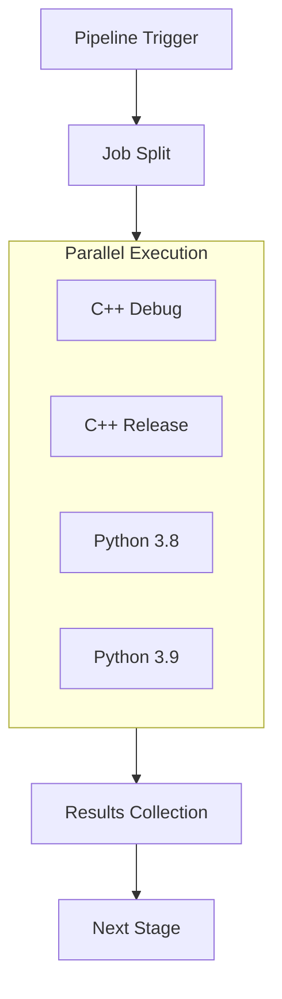
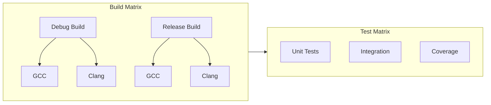
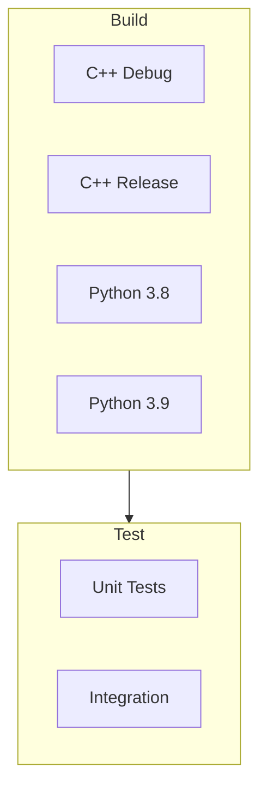

# Parallel Job Execution

## Overview

Parallel job execution in GitLab CI/CD allows simultaneous processing of independent tasks, significantly reducing pipeline execution time. This guide covers strategies for implementing and optimizing parallel execution.



## Configuration Methods

### Matrix Jobs

```yaml
cpp:build:
  parallel:
    matrix:
      - BUILD_TYPE: [Debug, Release]
      - COMPILER: [gcc, clang]
  script:
    - make .build-cpp BUILD_TYPE=$BUILD_TYPE CXX=$COMPILER
```

### Multiple Job Definitions
```yaml
cpp:build:debug:
  script:
    - make .build-cpp BUILD_TYPE=Debug

cpp:build:release:
  script:
    - make .build-cpp BUILD_TYPE=Release
```

## Resource Management

### Job Distribution
```yaml
default:
  interruptible: true
  tags:
    - docker

variables:
  GIT_STRATEGY: fetch
```

### Runner Configuration
```yaml
.build_job:
  parallel: 4
  resource_group: build
  variables:
    PARALLEL_JOBS: 2
```

## Optimization Strategies

### Build Matrix Organization


### Dependencies Management
```yaml
# Job dependencies
cpp:test:
  needs:
    - job: cpp:build
      artifacts: true
  parallel:
    matrix:
      - TEST_SUITE: [unit, integration]
```

## Common Patterns

### Language-Specific Parallel Jobs

#### C++ Jobs
```yaml
.cpp_matrix:
  parallel:
    matrix:
      - BUILD_TYPE: [Debug, Release]
      - COMPILER: [gcc, clang]
      - ARCH: [x86_64, arm64]
    exclude:
      - BUILD_TYPE: Debug
        ARCH: arm64

cpp:build:
  extends: .cpp_matrix
  script:
    - make .build-cpp
```

#### Python Jobs
```yaml
.python_matrix:
  parallel:
    matrix:
      - PYTHON_VERSION: [3.8, 3.9]
      - TEST_TYPE: [unit, integration]

python:test:
  extends: .python_matrix
  script:
    - make .test-python
```

## Resource Optimization

### Cache Strategy
```yaml
.cached_job:
  cache:
    key:
      files:
        - Makefile
        - cmake/
    paths:
      - build/
      - .ccache/
    policy: pull-push
```

### Artifact Management
```yaml
.artifact_job:
  artifacts:
    expire_in: 1 week
    paths:
      - build/$BUILD_TYPE/
    when: on_success
```

## Performance Tuning

### Job Parallelization
```yaml
# Optimize parallel execution
variables:
  MAKEFLAGS: "-j4"
  CARGO_BUILD_JOBS: "4"
  CMAKE_BUILD_PARALLEL_LEVEL: "4"
```

### Resource Allocation
```yaml
.resource_config:
  variables:
    FF_USE_FASTZIP: "true"
  resource_group: ${CI_JOB_NAME}
```

## Pipeline Organization

### Stage Distribution


### Workflow Rules
```yaml
workflow:
  rules:
    - if: $CI_PIPELINE_SOURCE == "merge_request_event"
      variables:
        PARALLEL_JOBS: 2
    - if: $CI_COMMIT_BRANCH == $CI_DEFAULT_BRANCH
      variables:
        PARALLEL_JOBS: 4
```

## Best Practices

### Job Design
- Independent execution paths
- Minimal shared resources
- Clear dependencies
- Efficient artifact handling

### Resource Usage
- Appropriate parallelization
- Cache optimization
- Resource group allocation
- Runner distribution

### Pipeline Efficiency
- Strategic job splitting
- Dependency management
- Result aggregation
- Clear stage progression

## Monitoring

### Performance Metrics
```yaml
.monitored_job:
  variables:
    CI_DEBUG_TRACE: "true"
  after_script:
    - echo "Job duration: $CI_JOB_DURATION"
```

### Resource Tracking
```yaml
.resource_tracking:
  before_script:
    - df -h
    - free -m
  after_script:
    - df -h
    - free -m
```

## Troubleshooting

### Common Issues
| Issue | Cause | Solution |
|-------|-------|----------|
| Resource contention | Over-parallelization | Adjust parallel jobs |
| Cache conflicts | Shared cache keys | Use distinct keys |
| Runner overload | Too many jobs | Configure job limits |
| Memory exhaustion | Large parallel jobs | Adjust resource limits |

### Debug Configuration
```yaml
.debug_parallel:
  variables:
    CI_DEBUG_TRACE: "true"
    FF_DEBUG_JOB: "true"
  before_script:
    - set -x
```

## Examples

### Complex Matrix
```yaml
test:matrix:
  parallel:
    matrix:
      - BUILD_TYPE: [Debug, Release]
      - COMPILER: [gcc, clang]
      - SANITIZER: [address, thread, undefined]
    exclude:
      - COMPILER: gcc
        SANITIZER: thread
```

### Resource Groups
```yaml
build:parallel:
  parallel: 4
  resource_group: ${CI_JOB_NAME}
  script:
    - make -j${PARALLEL_JOBS}
```

## See Also

- [Pipeline Overview](pipeline-overview.md)
- [Job Templates](job-templates.md)
- [Caching Strategy](caching-strategy.md)
