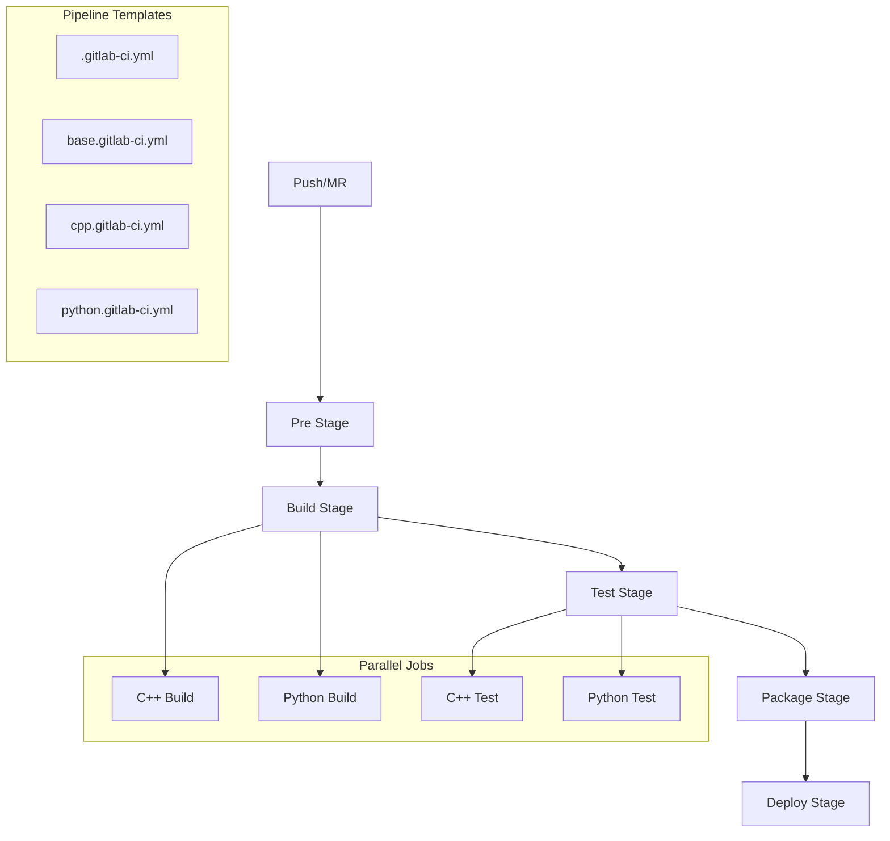

# CI/CD Pipeline Overview

## Architecture

The CI/CD pipeline provides a modular, template-based approach to building, testing, and deploying multi-language projects. It leverages GitLab CI/CD with Docker executors for consistent environments.



## Pipeline Structure

### File Organization
```
.gitlab/
├── ci/
│   ├── base.gitlab-ci.yml     # Common configuration
│   ├── cpp.gitlab-ci.yml      # C++ specific jobs
│   └── python.gitlab-ci.yml   # Python specific jobs
└── .gitlab-ci.yml            # Main pipeline definition
```

### Stage Definitions
1. **Pre Stage** (.pre)
   - Docker image builds
   - Environment preparation
   - Cache warming

2. **Build Stage**
   - Language-specific builds
   - Parallel execution
   - Artifact generation

3. **Test Stage**
   - Unit tests
   - Integration tests
   - Coverage reporting

4. **Package Stage**
   - Distribution packaging
   - Version tagging
   - Artifact publishing

5. **Deploy Stage**
   - Environment deployments
   - Release management
   - Documentation updates

## Pipeline Configuration

### Main Pipeline
```yaml
# .gitlab-ci.yml
include:
  - local: .gitlab/ci/base.gitlab-ci.yml
  - local: .gitlab/ci/cpp.gitlab-ci.yml
  - local: .gitlab/ci/python.gitlab-ci.yml

variables:
  GIT_STRATEGY: fetch
  GIT_CLEAN_FLAGS: -ffdx
```

### Base Configuration
```yaml
# base.gitlab-ci.yml
default:
  interruptible: true

stages:
  - build
  - test
  - package
  - deploy

.base_job:
  image: $CI_REGISTRY_IMAGE/base:latest
  cache:
    paths:
      - build/
      - .ccache/
      - .venv/
```

## Job Templates

### Build Templates
```yaml
.build_template:
  stage: build
  script:
    - make build
  artifacts:
    paths:
      - build/
      - dist/
```

### Test Templates
```yaml
.test_template:
  stage: test
  script:
    - make test
  coverage: '/TOTAL.+ ([0-9]{1,3}%)/'
  artifacts:
    reports:
      coverage_report:
        coverage_format: cobertura
        path: coverage.xml
```

## Parallel Execution

### Language-Specific Jobs
```yaml
cpp:build:
  extends: .build_template
  parallel:
    matrix:
      - BUILD_TYPE: [Debug, Release]

python:build:
  extends: .build_template
  parallel:
    matrix:
      - PYTHON_VERSION: [3.8, 3.9]
```

## Resource Management

### Cache Configuration
```yaml
cache:
  key: ${CI_COMMIT_REF_SLUG}
  paths:
    - build/
    - .ccache/
    - .venv/
  policy: pull-push
```

### Artifacts
```yaml
artifacts:
  paths:
    - build/
    - dist/
  reports:
    coverage_report:
      coverage_format: cobertura
      path: coverage.xml
    junit: test-results.xml
```

## Environment Management

### Environment Variables
```yaml
variables:
  BUILD_TYPE: Release
  DOCKER_REGISTRY: $CI_REGISTRY
  DOCKER_TAG: $CI_COMMIT_SHA
```

### Deployment Configuration
```yaml
.deploy_template:
  stage: deploy
  rules:
    - if: $CI_COMMIT_TAG
      when: on_success
    - when: manual
  environment:
    name: production
```

## Best Practices

### Pipeline Design
- Use modular templates
- Enable parallel execution
- Implement caching
- Handle artifacts efficiently

### Job Configuration
- Clear stage organization
- Consistent naming
- Proper dependencies
- Resource optimization

### Environment Management
- Secure variable handling
- Environment isolation 
- Deployment controls
- Version management

## Performance Optimization

### Cache Strategies
- Layer caching for Docker
- Compiler cache (ccache)
- Dependency caching
- Artifact management

### Job Execution
- Parallel processing
- Resource allocation
- Stage dependencies
- Execution order

## Security Considerations

### Access Control
- Protected variables
- Secure credentials
- Environment restrictions
- Deploy permissions

### Image Security
- Image scanning
- Version control
- Security updates
- Base image maintenance

## Monitoring and Feedback

### Pipeline Metrics
- Build duration
- Test coverage
- Success rate
- Resource usage

### Reporting
- Test results
- Coverage reports
- Artifact tracking
- Deployment status

## Common Issues

### Pipeline Problems
| Issue | Cause | Solution |
|-------|-------|----------|
| Cache miss | Invalid key | Clear cache |
| Job timeout | Resource limits | Adjust timeouts |
| Build fail | Dependencies | Check requirements |
| Deploy error | Permissions | Verify access |

### Debug Tools
```bash
# Pipeline validation
gitlab-ci-lint

# Job debug
gitlab-runner exec docker job-name
```

## See Also

- [Job Templates](job-templates.md)
- [Parallel Execution](parallel-execution.md)
- [Caching Strategy](caching-strategy.md)
- [Build System Overview](../build-system/overview.md)
