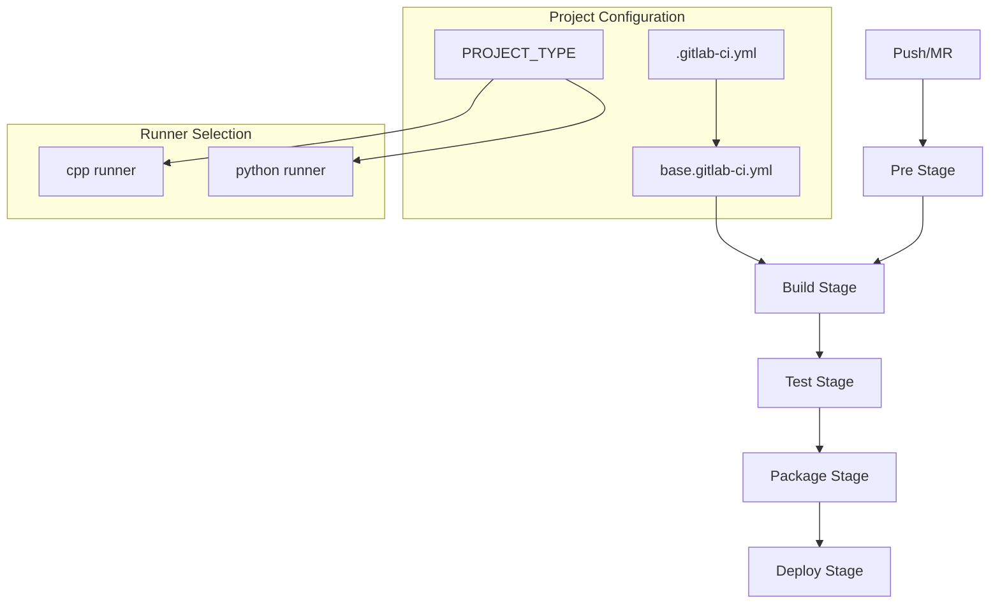

# CI/CD Pipeline Overview

## Architecture

The CI/CD pipeline provides a template-based approach to building, testing, and deploying projects. It uses PROJECT_TYPE to determine the appropriate runner and environment, leveraging GitLab CI/CD with Docker executors for consistent environments.



## Pipeline Structure

### File Organization
```
.gitlab/
├── ci/
│   ├── base.gitlab-ci.yml     # Common pipeline configuration
│   ├── cpp.gitlab-ci.yml      # C++ runner configuration
│   └── python.gitlab-ci.yml   # Python runner configuration
└── .gitlab-ci.yml            # Project-specific configuration
```

### Stage Descriptions

1. **Pre Stage** (.pre)
   - Purpose: Prepare build environment
   - Actions: Docker image pulls, cache setup
   - Output: Ready build environment

2. **Build Stage**
   - Purpose: Build project artifacts
   - Actions: Execute `make build`
   - Output: Build artifacts

3. **Test Stage**
   - Purpose: Validate project
   - Actions: Execute `make test`
   - Output: Test results and coverage

4. **Package Stage**
   - Purpose: Create distribution packages
   - Actions: Execute `make package`
   - Output: Distribution artifacts

5. **Deploy Stage**
   - Purpose: Deploy project
   - Actions: Execute `make deploy`
   - Output: Deployment status

## Pipeline Configuration

### Project Configuration
```yaml
# .gitlab-ci.yml
include:
  - local: .gitlab/ci/base.gitlab-ci.yml

variables:
  PROJECT_TYPE: cpp  # or 'python'
  GIT_STRATEGY: fetch
```

### Base Configuration
```yaml
# base.gitlab-ci.yml
default:
  interruptible: true

stages:
  - build
  - test
  - package
  - deploy

.base_job:
  image: $CI_REGISTRY_IMAGE/$PROJECT_TYPE:latest
  cache:
    paths:
      - build/
      - dist/
```

## Job Templates

### Build Jobs
```yaml
# Description: Builds project using appropriate runner
build:
  extends: .base_job
  stage: build
  script:
    - make build
  artifacts:
    paths:
      - build/
      - dist/
```

### Test Jobs
```yaml
# Description: Runs project tests with coverage
test:
  extends: .base_job
  stage: test
  script:
    - make test
  coverage: '/TOTAL.+ ([0-9]{1,3}%)/'
  artifacts:
    reports:
      coverage_report:
        coverage_format: cobertura
        path: coverage.xml
```

### Package Jobs
```yaml
# Description: Creates distribution packages
package:
  extends: .base_job
  stage: package
  script:
    - make package
  artifacts:
    paths:
      - dist/
```

## Resource Management

### Cache Configuration
```yaml
cache:
  key: ${CI_COMMIT_REF_SLUG}
  paths:
    - build/
    - dist/
  policy: pull-push
```

### Build Artifacts
```yaml
artifacts:
  paths:
    - build/
    - dist/
  reports:
    coverage_report:
      coverage_format: cobertura
      path: coverage.xml
    junit: test-results.xml
```

## Runner Configuration

### C++ Runner
```yaml
# cpp.gitlab-ci.yml
.cpp_runner:
  tags:
    - cpp
  variables:
    BUILD_TYPE: Release
    CCACHE_DIR: .ccache
```

### Python Runner
```yaml
# python.gitlab-ci.yml
.python_runner:
  tags:
    - python
  variables:
    VIRTUAL_ENV: .venv
    PYTHONPATH: src
```

## Environment Management

### Common Variables
```yaml
variables:
  BUILD_TYPE: Release
  DOCKER_REGISTRY: $CI_REGISTRY
  DOCKER_TAG: $CI_COMMIT_SHA
```

### Deployment Settings
```yaml
.deploy_template:
  stage: deploy
  rules:
    - if: $CI_COMMIT_TAG
      when: on_success
    - when: manual
  environment:
    name: production
```

## Best Practices

### Pipeline Design
- Specify PROJECT_TYPE explicitly
- Use provided runners
- Implement efficient caching
- Handle artifacts properly

### Job Configuration
- Follow stage progression
- Use appropriate runners
- Manage resources efficiently
- Handle errors gracefully

### Environment Management
- Secure sensitive variables
- Isolate environments
- Control deployments
- Track versions

## Performance Optimization

### Caching Strategy
- Runner-specific caching
- Build artifact caching
- Dependency caching
- Layer optimization

### Job Execution
- Appropriate runner selection
- Resource allocation
- Dependency management
- Error handling

## Security Considerations

### Access Control
- Protected variables
- Secure credentials
- Environment restrictions
- Runner access control

### Runner Security
- Image scanning
- Version control
- Regular updates
- Access limitations

## Monitoring and Reporting

### Pipeline Metrics
- Build duration
- Test coverage
- Success rates
- Resource usage

### Build Reports
- Test results
- Coverage data
- Artifact tracking
- Deployment status

## Common Issues

### Pipeline Problems
| Issue | Solution |
|-------|----------|
| Wrong runner | Check PROJECT_TYPE |
| Cache miss | Verify cache key |
| Build fail | Check make targets |
| Runner offline | Contact support |

### Debugging
```bash
# Pipeline validation
gitlab-ci-lint

# Local job testing
gitlab-runner exec docker job-name
```

## See Also

- [Job Templates](job-templates.md)
- [Parallel Execution](parallel-execution.md)
- [Caching Strategy](caching-strategy.md)
- [Build System Overview](../build-system/overview.md)
