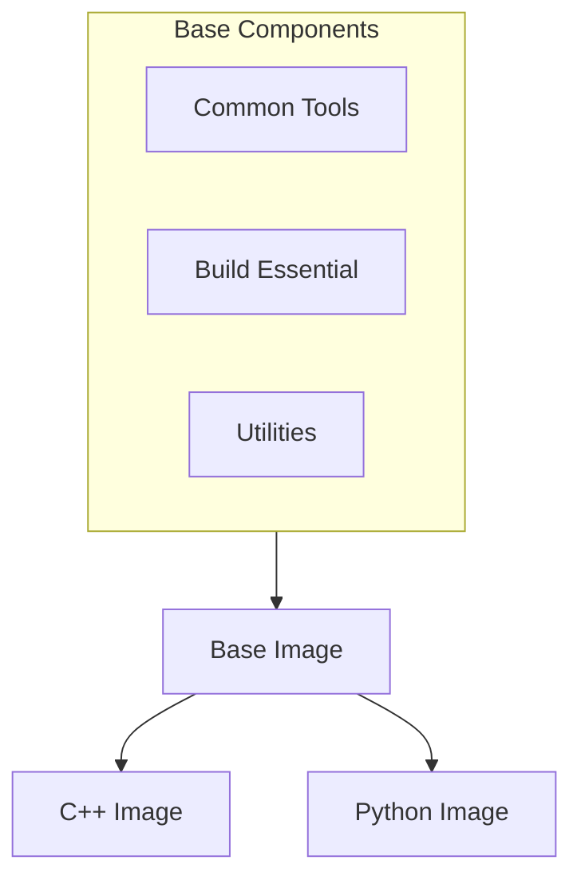
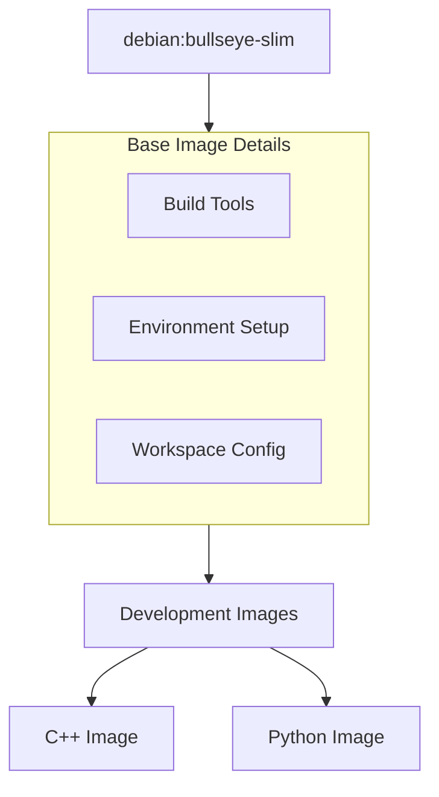

# Base Docker Image Configuration

## Overview

The base Docker image provides a consistent foundation for all language-specific build environments. It includes common tools and utilities needed across different build configurations while maintaining a minimal footprint.



## Base Image Configuration

### Dockerfile
```dockerfile
# Use a stable debian base
FROM debian:bullseye-slim

# Build arguments
ARG BUILD_TYPE=Release
ENV BUILD_TYPE=${BUILD_TYPE}

# Install common build tools and utilities
RUN apt-get update && apt-get install -y --no-install-recommends \
    build-essential \
    ca-certificates \
    curl \
    git \
    gnupg \
    make \
    pkg-config \
    wget \
    && rm -rf /var/lib/apt/lists/*

# Set up working directory
WORKDIR /workspace

# Add common environment variables
ENV PATH="/workspace/bin:${PATH}"
ENV BUILD_DIR=/workspace/build
ENV DIST_DIR=/workspace/dist

# Create build and dist directories
RUN mkdir -p ${BUILD_DIR} ${DIST_DIR}

# Health check
HEALTHCHECK --interval=30s --timeout=30s --start-period=5s --retries=3 \
    CMD [ "make", "--version" ]

# Default command
CMD ["/bin/bash"]
```

## Key Components

### System Tools
| Tool | Purpose | Version |
|------|---------|---------|
| build-essential | Basic build tools | Latest |
| git | Version control | Latest |
| make | Build automation | Latest |
| curl/wget | Network transfers | Latest |
| pkg-config | Build configuration | Latest |

### Environment Setup
| Variable | Purpose | Default |
|----------|---------|---------|
| BUILD_TYPE | Build configuration | Release |
| BUILD_DIR | Build output location | /workspace/build |
| DIST_DIR | Distribution location | /workspace/dist |
| PATH | Binary search path | /workspace/bin:$PATH |

## Usage

### Building the Image
```bash
# Basic build
docker build -t registry.com/base:latest -f docker/base/Dockerfile .

# With custom build type
docker build -t registry.com/base:latest \
    --build-arg BUILD_TYPE=Debug \
    -f docker/base/Dockerfile .
```

### Running the Container
```bash
# Interactive shell
docker run -it --rm registry.com/base:latest

# Mount local directory
docker run -it --rm \
    -v "$(pwd):/workspace" \
    registry.com/base:latest
```

## Image Hierarchy



## Directory Structure

```
/workspace/
├── bin/                # Custom binaries
├── build/             # Build artifacts
│   ├── cpp/
│   └── python/
└── dist/              # Distribution packages
    ├── cpp/
    └── python/
```

## Best Practices

### Image Size Optimization
- Use `--no-install-recommends` with apt-get
- Clean apt cache after installation
- Combine RUN commands
- Use multi-stage builds when possible

### Security
- Regular base image updates
- Minimal installed packages
- No unnecessary privileges
- Clean build artifacts

### Performance
- Layer optimization
- Efficient caching
- Resource constraints
- Network efficiency

## Configuration Options

### Build Arguments
```dockerfile
# Available build arguments
ARG BUILD_TYPE=Release   # Build configuration
ARG DEBIAN_VERSION=bullseye   # Base image version
```

### Environment Variables
```bash
# Default environment setup
export BUILD_TYPE=Release
export BUILD_DIR=/workspace/build
export DIST_DIR=/workspace/dist
```

## Health Checks

### Default Check
```dockerfile
# Verify make installation
HEALTHCHECK --interval=30s --timeout=30s --start-period=5s --retries=3 \
    CMD [ "make", "--version" ]
```

### Custom Checks
```bash
# Manual health verification
docker inspect --format='{{json .State.Health}}' container_name
```

## Common Issues

### Build Problems
| Issue | Cause | Solution |
|-------|-------|----------|
| Network error | Connection issues | Check network/proxy |
| Permission denied | File permissions | Fix ownership/permissions |
| Space error | Insufficient space | Clean old images/containers |

### Runtime Issues
- Container access problems
- Mount point permissions
- Environment variables
- Network connectivity

## Maintenance

### Regular Updates
```bash
# Pull latest base image
docker pull debian:bullseye-slim

# Rebuild base image
docker build --no-cache -t registry.com/base:latest .
```

### Cleanup
```bash
# Remove old images
docker image prune -a

# Clean build cache
docker builder prune
```

## Integration

### With Make System
```makefile
# Build base image
.PHONY: docker-base
docker-base:
    docker build -t registry.com/base:latest .

# Use in builds
.PHONY: build
build: docker-base
    docker run --rm registry.com/base:latest make
```

### With CI/CD
```yaml
# GitLab CI example
build_base:
  stage: prepare
  script:
    - docker build -t $CI_REGISTRY_IMAGE/base:latest .
    - docker push $CI_REGISTRY_IMAGE/base:latest
```

## See Also

- [C++ Environment](cpp-environment.md)
- [Python Environment](python-environment.md)
- [Build System Overview](../build-system/overview.md)
