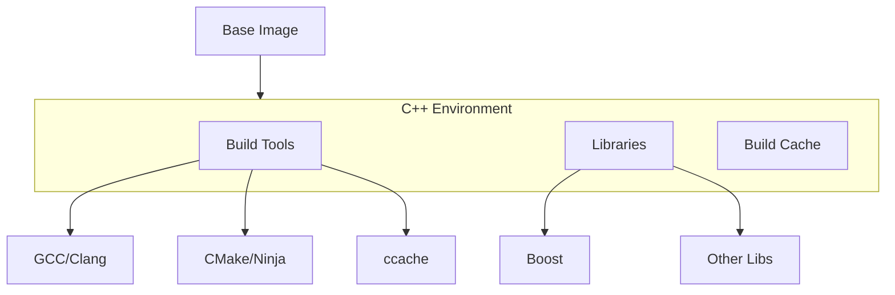

# C++ Docker Environment

## Overview

The C++ Docker environment extends the base image to provide a complete C++ development and build environment, including compilers, build tools, and common libraries.



## Image Configuration

### Dockerfile
```dockerfile
# Use our base image
FROM registry.gitlab.com/${CI_PROJECT_PATH}/base:latest

# Build arguments
ARG CMAKE_VERSION=3.25.1
ARG BUILD_TYPE=Release
ENV BUILD_TYPE=${BUILD_TYPE}

# Install C++ specific tools and libraries
RUN apt-get update && apt-get install -y --no-install-recommends \
    ccache \
    clang \
    clang-format \
    clang-tidy \
    cmake \
    cppcheck \
    g++ \
    gcovr \
    gdb \
    libboost-all-dev \
    ninja-build \
    && rm -rf /var/lib/apt/lists/*

# Configure ccache
ENV CCACHE_DIR=/ccache
ENV PATH="/usr/lib/ccache:${PATH}"
RUN mkdir -p ${CCACHE_DIR}

# Set up CMake environment variables
ENV CMAKE_BUILD_TYPE=${BUILD_TYPE}
ENV CMAKE_EXPORT_COMPILE_COMMANDS=ON
ENV CMAKE_GENERATOR="Ninja"

# Default working directory for C++ projects
WORKDIR /workspace/cpp

# Health check
HEALTHCHECK --interval=30s --timeout=30s --start-period=5s --retries=3 \
    CMD [ "g++", "--version" ]
```

## Components

### Build Tools
| Tool | Purpose | Version |
|------|---------|---------|
| GCC/Clang | Compilers | Latest |
| CMake | Build system | 3.25+ |
| Ninja | Build system | Latest |
| ccache | Compiler cache | Latest |

### Development Tools
| Tool | Purpose | Usage |
|------|---------|-------|
| clang-format | Code formatting | `clang-format -i file.cpp` |
| clang-tidy | Static analysis | `clang-tidy file.cpp` |
| cppcheck | Static analysis | `cppcheck src/` |
| gdb | Debugging | `gdb ./program` |

### Libraries
| Library | Purpose | Version |
|---------|---------|---------|
| Boost | C++ utilities | Latest |
| Standard Library | C++ standard | C++17 |

## Usage

### Building the Image
```bash
# Basic build
docker build -t registry.com/cpp:latest -f docker/cpp/Dockerfile .

# With specific CMake version
docker build -t registry.com/cpp:latest \
    --build-arg CMAKE_VERSION=3.25.1 \
    -f docker/cpp/Dockerfile .
```

### Development Environment
```bash
# Interactive development
docker run -it --rm \
    -v "$(pwd):/workspace/cpp" \
    -v "${HOME}/.ccache:/ccache" \
    registry.com/cpp:latest

# Build specific target
docker run --rm \
    -v "$(pwd):/workspace/cpp" \
    registry.com/cpp:latest \
    make .build-cpp
```

## Build Configuration

### CMake Setup
```bash
# Configure project
cmake -B build \
    -G Ninja \
    -DCMAKE_BUILD_TYPE=Release \
    -DCMAKE_EXPORT_COMPILE_COMMANDS=ON

# Build project
cmake --build build -j$(nproc)
```

### Compiler Cache
```bash
# Configure ccache
ccache --max-size=10G
ccache --set-config=compression=true

# Check statistics
ccache -s
```

## Best Practices

### Image Optimization
- Use multi-stage builds
- Minimize layer size
- Optimize cache usage
- Clean build artifacts

### Development Workflow
- Mount source code
- Share compiler cache
- Use consistent toolchain
- Enable compiler warnings

### Build Performance
- Use Ninja generator
- Enable ccache
- Parallel compilation
- Efficient dependencies

## Environment Variables

### Build Configuration
```bash
# CMake configuration
CMAKE_BUILD_TYPE=Release
CMAKE_GENERATOR=Ninja
CMAKE_EXPORT_COMPILE_COMMANDS=ON

# Compiler settings
CC=gcc
CXX=g++
CXXFLAGS="-Wall -Wextra"

# Cache configuration
CCACHE_DIR=/ccache
CCACHE_MAXSIZE=10G
```

## Common Workflows

### Local Development
```bash
# Start development container
docker run -it --rm \
    -v "$(pwd):/workspace/cpp" \
    -v "${HOME}/.ccache:/ccache" \
    registry.com/cpp:latest

# Build and test
cmake -B build
cmake --build build
ctest --test-dir build
```

### CI/CD Integration
```yaml
# GitLab CI example
cpp:build:
  image: $CI_REGISTRY_IMAGE/cpp:latest
  script:
    - cmake -B build
    - cmake --build build
  artifacts:
    paths:
      - build/
```

## Troubleshooting

### Common Issues
| Issue | Cause | Solution |
|-------|-------|----------|
| Build fails | Missing dependencies | Install required packages |
| Cache miss | Invalid cache | Clear ccache |
| Link error | Missing library | Add library to link |
| CMake error | Wrong generator | Set correct generator |

### Debug Tools
```bash
# GDB debugging
gdb ./program

# Memory checking
valgrind ./program

# Static analysis
clang-tidy src/*.cpp
```

## Examples

### Building Projects
```bash
# Configure and build
docker run --rm \
    -v "$(pwd):/workspace/cpp" \
    registry.com/cpp:latest \
    bash -c "cmake -B build && cmake --build build"

# Run tests
docker run --rm \
    -v "$(pwd):/workspace/cpp" \
    registry.com/cpp:latest \
    bash -c "cd build && ctest"
```

### Development Tasks
```bash
# Format code
docker run --rm \
    -v "$(pwd):/workspace/cpp" \
    registry.com/cpp:latest \
    clang-format -i src/*.cpp include/*.hpp

# Static analysis
docker run --rm \
    -v "$(pwd):/workspace/cpp" \
    registry.com/cpp:latest \
    cppcheck --enable=all src/
```

## See Also

- [Base Image Configuration](base-image.md)
- [C++ Build Guide](../build-system/cpp-builds.md)
- [Build System Overview](../build-system/overview.md)
