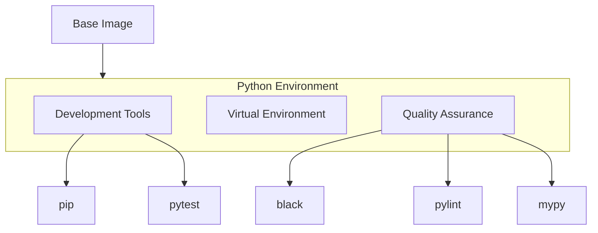

# Python Docker Environment

## Overview

The Python Docker environment extends the base image to provide a comprehensive Python development and build environment, including virtual environment support, testing tools, and code quality utilities.



## Image Configuration

### Dockerfile
```dockerfile
# Use our base image
FROM registry.gitlab.com/${CI_PROJECT_PATH}/base:latest

# Build arguments
ARG PYTHON_VERSION=3.9
ARG BUILD_TYPE=Release
ENV BUILD_TYPE=${BUILD_TYPE}

# Install Python and development tools
RUN apt-get update && apt-get install -y --no-install-recommends \
    python${PYTHON_VERSION} \
    python${PYTHON_VERSION}-dev \
    python${PYTHON_VERSION}-venv \
    python3-pip \
    python3-wheel \
    && rm -rf /var/lib/apt/lists/*

# Create symbolic links for python and pip
RUN ln -sf /usr/bin/python${PYTHON_VERSION} /usr/local/bin/python3 && \
    ln -sf /usr/bin/python${PYTHON_VERSION} /usr/local/bin/python

# Set up virtual environment
ENV VIRTUAL_ENV=/workspace/venv
RUN python -m venv $VIRTUAL_ENV
ENV PATH="$VIRTUAL_ENV/bin:$PATH"

# Install common Python packages
RUN pip install --no-cache-dir \
    black \
    flake8 \
    mypy \
    pylint \
    pytest \
    pytest-cov \
    tox

# Set up Python specific environment variables
ENV PYTHONUNBUFFERED=1
ENV PYTHONDONTWRITEBYTECODE=1
ENV PIP_NO_CACHE_DIR=1

# Default working directory for Python projects
WORKDIR /workspace/python

# Health check
HEALTHCHECK --interval=30s --timeout=30s --start-period=5s --retries=3 \
    CMD [ "python", "--version" ]
```

## Components

### Development Tools
| Tool | Purpose | Version |
|------|---------|---------|
| Python | Runtime | 3.9+ |
| pip | Package manager | Latest |
| venv | Virtual environment | Built-in |
| wheel | Package building | Latest |

### Quality Assurance
| Tool | Purpose | Usage |
|------|---------|-------|
| black | Code formatting | `black src/` |
| pylint | Linting | `pylint src/` |
| mypy | Type checking | `mypy src/` |
| flake8 | Style guide | `flake8 src/` |

### Testing Tools
| Tool | Purpose | Version |
|------|---------|---------|
| pytest | Testing framework | Latest |
| pytest-cov | Coverage reporting | Latest |
| tox | Test automation | Latest |

## Usage

### Building the Image
```bash
# Basic build
docker build -t registry.com/python:latest -f docker/python/Dockerfile .

# With specific Python version
docker build -t registry.com/python:latest \
    --build-arg PYTHON_VERSION=3.9 \
    -f docker/python/Dockerfile .
```

### Development Environment
```bash
# Interactive development
docker run -it --rm \
    -v "$(pwd):/workspace/python" \
    registry.com/python:latest

# Run tests
docker run --rm \
    -v "$(pwd):/workspace/python" \
    registry.com/python:latest \
    pytest
```

## Virtual Environment

### Configuration
```bash
# Virtual environment location
VIRTUAL_ENV=/workspace/venv

# Activate virtual environment
source $VIRTUAL_ENV/bin/activate

# Install project dependencies
pip install -r requirements.txt
```

### Development Dependencies
```bash
# Install development tools
pip install -r requirements-dev.txt

# Update dependencies
pip install --upgrade -r requirements.txt
```

## Best Practices

### Image Optimization
- Minimize installed packages
- Use no-cache-dir for pip
- Clean apt cache
- Layer optimization

### Development Workflow
- Use virtual environments
- Pin dependency versions
- Regular dependency updates
- Code quality checks

### Testing Strategy
- Comprehensive test suite
- Coverage reporting
- Type checking
- Style conformance

## Environment Variables

### Python Configuration
```bash
# Python settings
PYTHONPATH=/workspace/python/src
PYTHONUNBUFFERED=1
PYTHONDONTWRITEBYTECODE=1

# Pip configuration
PIP_NO_CACHE_DIR=1
PIP_DISABLE_PIP_VERSION_CHECK=1

# Testing
PYTEST_ADDOPTS="-v --cov"
```

## Common Workflows

### Local Development
```bash
# Start development container
docker run -it --rm \
    -v "$(pwd):/workspace/python" \
    registry.com/python:latest

# Install dependencies and run tests
pip install -r requirements.txt
pytest
```

### CI/CD Integration
```yaml
# GitLab CI example
python:test:
  image: $CI_REGISTRY_IMAGE/python:latest
  script:
    - pip install -r requirements.txt
    - pytest --cov
  coverage: '/TOTAL.+ ([0-9]{1,3}%)/'
```

## Troubleshooting

### Common Issues
| Issue | Cause | Solution |
|-------|-------|----------|
| Import error | Wrong PYTHONPATH | Set correct path |
| Package not found | Missing dependency | Install package |
| Permission error | Volume mounting | Fix permissions |
| Test failure | Environment issue | Check virtual env |

### Debug Tools
```bash
# Check Python environment
python -m site

# List installed packages
pip list

# Show package details
pip show package-name
```

## Examples

### Package Management
```bash
# Install project in dev mode
docker run --rm \
    -v "$(pwd):/workspace/python" \
    registry.com/python:latest \
    pip install -e .

# Run type checking
docker run --rm \
    -v "$(pwd):/workspace/python" \
    registry.com/python:latest \
    mypy src/
```

### Code Quality
```bash
# Format code
docker run --rm \
    -v "$(pwd):/workspace/python" \
    registry.com/python:latest \
    black src/

# Run linting
docker run --rm \
    -v "$(pwd):/workspace/python" \
    registry.com/python:latest \
    pylint src/
```

## See Also

- [Base Image Configuration](base-image.md)
- [Python Build Guide](../build-system/python-builds.md)
- [Build System Overview](../build-system/overview.md)
