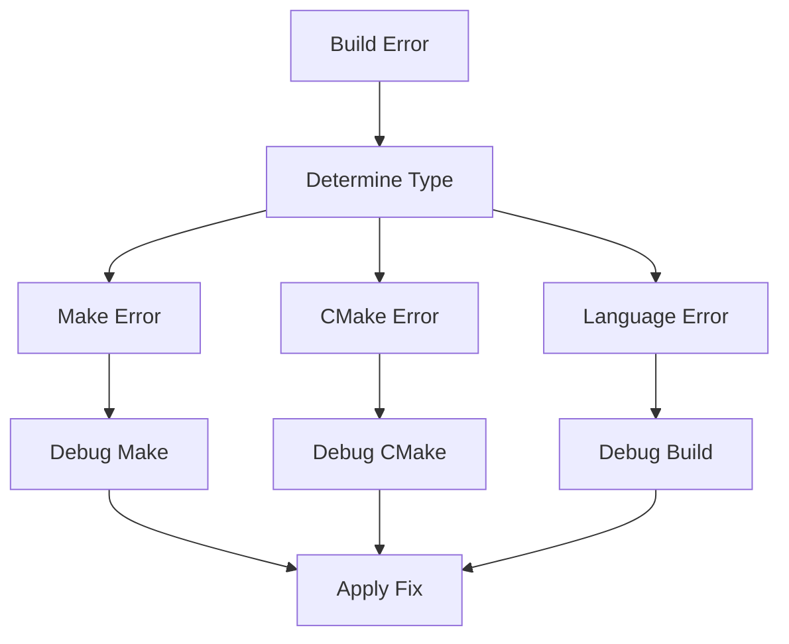

# Build System Troubleshooting

## Overview

This guide focuses on diagnosing and resolving problems specific to the build system, including Make, CMake, and language-specific build issues.

## Build System Diagnostics



## Make Problems

### Debugging Make

```bash
# Show make's actions
make -n target

# Debug output
make -d target

# Print database
make -p

# Trace execution
make --trace target
```

### Common Make Issues

| Issue | Symptom | Solution |
|-------|---------|----------|
| Circular dependency | `Circular dependency dropped` | Check dependencies |
| Missing target | `No rule to make target` | Add target rule |
| Wrong order | Target built too early | Fix prerequisites |

### Make Debug Examples
```makefile
# Debug target
debug-make:
    @echo "MAKE_VERSION=$(MAKE_VERSION)"
    @echo "MAKEFLAGS=$(MAKEFLAGS)"
    @echo "CURDIR=$(CURDIR)"
```

## CMake Problems

### CMake Debugging

```bash
# Verbose CMake output
cmake -DCMAKE_VERBOSE_MAKEFILE=ON .

# Debug find_package
cmake --debug-find .

# Trace variables
cmake --trace-expand .
```

### Common CMake Issues

| Issue | Symptom | Solution |
|-------|---------|----------|
| Package not found | `Could NOT find Package` | Install package or fix path |
| Wrong generator | `Generator not found` | Install or select correct generator |
| Config error | `Configuration failed` | Check CMakeLists.txt |

### CMake Debug Examples
```cmake
# Debug print variables
message(STATUS "CMAKE_CXX_COMPILER: ${CMAKE_CXX_COMPILER}")
message(STATUS "CMAKE_BUILD_TYPE: ${CMAKE_BUILD_TYPE}")
```

## C++ Build Issues

### Compiler Debugging

```bash
# Verbose compilation
make .build-cpp VERBOSE=1

# Preprocessor output
g++ -E source.cpp

# Assembly output
g++ -S source.cpp
```

### Common C++ Issues

| Issue | Symptom | Solution |
|-------|---------|----------|
| Link error | `undefined reference` | Add library to linker |
| Include error | `No such file` | Fix include path |
| Version error | `requires compiler support` | Update compiler |

### C++ Debug Examples
```bash
# Show compiler commands
VERBOSE=1 make .build-cpp

# Check include paths
g++ -v source.cpp

# Check library paths
ld -v --verbose
```

## Python Build Issues

### Python Environment

```bash
# Check virtual environment
python -c "import sys; print(sys.prefix)"

# List installed packages
pip list

# Check package locations
python -m site
```

### Common Python Issues

| Issue | Symptom | Solution |
|-------|---------|----------|
| Import error | `ModuleNotFoundError` | Fix PYTHONPATH |
| Version conflict | `VersionConflict` | Fix requirements |
| Build error | `wheel build failed` | Install build deps |

### Python Debug Examples
```bash
# Debug package installation
pip install -v package_name

# Check dependencies
pip check

# Show package details
pip show package_name
```

## Docker Build Issues

### Docker Debugging

```bash
# Build with verbose output
docker build --progress=plain .

# Show build steps
docker history image_name

# Check build context
docker build --no-cache .
```

### Common Docker Issues

| Issue | Symptom | Solution |
|-------|---------|----------|
| Cache invalid | `Using cache` | Clear cache |
| Context error | `Sending build context` | Fix .dockerignore |
| Layer error | `Error building layer` | Check Dockerfile |

### Docker Debug Examples
```bash
# Debug layer creation
docker build --progress=plain --no-cache .

# Check image layers
docker history --no-trunc image_name
```

## Environment Problems

### System Resources

```bash
# Check disk space
df -h

# Check memory
free -h

# Check CPU usage
top -bn1
```

### Common Environment Issues

| Issue | Symptom | Solution |
|-------|---------|----------|
| No space | `No space left` | Clean builds |
| Memory error | `Killed` | Increase memory |
| Permission | `Permission denied` | Fix permissions |

### Environment Debug Examples
```bash
# Check resource limits
ulimit -a

# Monitor build resources
htop

# Check file permissions
ls -la build/
```

## Build Performance

### Performance Analysis

```bash
# Time make execution
time make target

# Profile compilation
perf record make target

# Analyze build dependencies
make -d target
```

### Common Performance Issues

| Issue | Symptom | Solution |
|-------|---------|----------|
| Slow build | Long build time | Enable parallel build |
| Cache miss | Rebuilding unchanged | Fix cache config |
| I/O bound | High disk activity | Optimize I/O |

### Performance Debug Examples
```bash
# Monitor I/O
iostat -x 1

# Check cache effectiveness
ccache -s

# Profile make
make --trace target
```

## Build Configuration

### Configuration Debugging

```bash
# Show make variables
make -p

# Show cmake variables
cmake -LAH

# Show environment
env | sort
```

### Common Configuration Issues

| Issue | Symptom | Solution |
|-------|---------|----------|
| Wrong toolchain | Build error | Fix toolchain file |
| Wrong flags | Compilation error | Check build flags |
| Wrong paths | Not found errors | Fix path variables |

### Configuration Debug Examples
```bash
# Check compiler flags
make VERBOSE=1 .build-cpp

# Show CMake config
cmake --system-information

# Check environment
printenv
```

## Advanced Debugging

### Build Analysis Tools

```bash
# Compilation database
compiledb make

# Build graph
make --trace | dot -Tpng > build-graph.png

# Dependencies
makedepend -f- source.cpp
```

### System Tools
```bash
# System calls
strace make target

# Library calls
ltrace ./program

# Resource usage
time make target
```

## See Also

- [Common Issues](common-issues.md)
- [Pipeline Debugging](pipeline-debugging.md)
- [Build System Overview](../build-system/overview.md)
