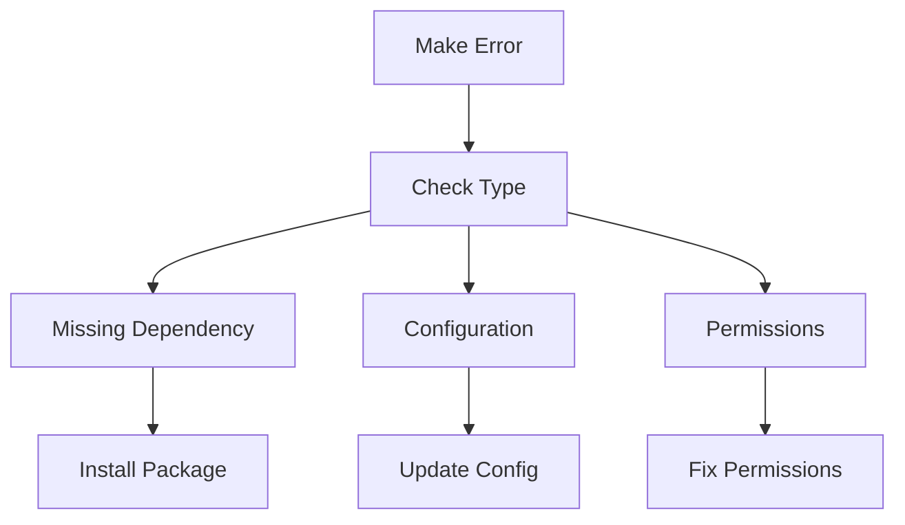
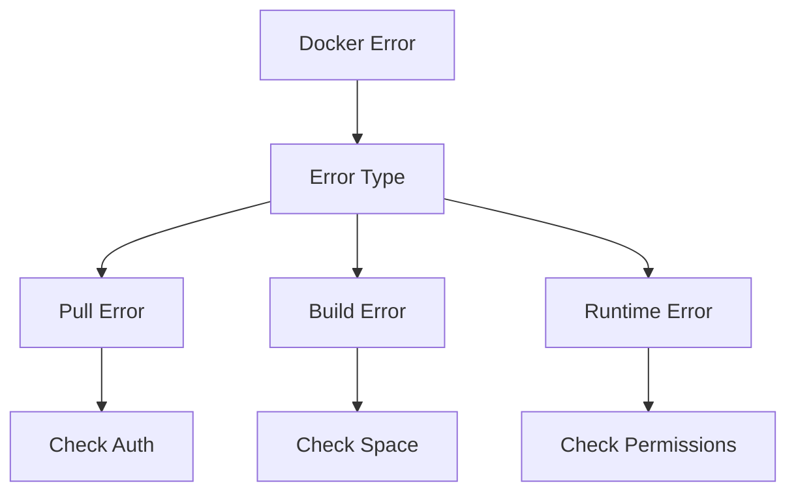

# Common Issues and Solutions

## Overview

This guide covers common issues encountered in the build system and CI/CD pipeline, along with their solutions and preventive measures.

## Quick Reference

| Issue Type | Common Symptoms | First Steps |
|------------|----------------|-------------|
| Build Failures | Compilation errors | Check logs, verify dependencies |
| Test Failures | Failed assertions | Review test output, check environment |
| Pipeline Issues | Job failures | Check GitLab CI configuration |
| Docker Problems | Container errors | Verify Docker setup, check logs |

## Build System Issues

### Make Problems



#### Common Make Errors
| Error | Cause | Solution |
|-------|-------|----------|
| `No rule to make target` | Missing file or rule | Check Makefile paths and targets |
| `Command not found` | Missing tool | Install required tool |
| `Permission denied` | File permissions | Fix file/directory permissions |

#### Solutions
```bash
# Fix permissions
chmod +x script.sh
chmod -R u+w build/

# Check make debug output
make -d target

# Verify make version
make --version
```

### CMake Issues

#### Common CMake Errors
| Error | Cause | Solution |
|-------|-------|----------|
| `Could NOT find Package` | Missing dependency | Install required package |
| `No CMAKE_CXX_COMPILER found` | Missing compiler | Install C++ compiler |
| `Target not found` | Incorrect target name | Check CMakeLists.txt |

#### Solutions
```bash
# Clear CMake cache
rm -rf build/CMakeCache.txt

# Debug CMake configuration
cmake -LAH

# Verify compiler
cmake --system-information
```

## Docker Issues

### Container Problems



#### Common Docker Errors
| Error | Cause | Solution |
|-------|-------|----------|
| `Image pull failed` | Registry auth | Check credentials |
| `No space left` | Disk space | Clean old images |
| `Permission denied` | Docker daemon | Check Docker permissions |

#### Solutions
```bash
# Check Docker status
docker info

# Clean up resources
docker system prune -af

# Check logs
docker logs container_name
```

## CI/CD Pipeline Issues

### Pipeline Failures

#### Common Pipeline Errors
| Error | Cause | Solution |
|-------|-------|----------|
| `Job failed` | Script error | Check job logs |
| `Runner error` | Runner issue | Verify runner status |
| `Artifact error` | Storage issue | Check artifact configuration |

#### Solutions
```yaml
# Debug job configuration
job_name:
  variables:
    CI_DEBUG_TRACE: "true"
  before_script:
    - env | sort
```

### Cache Problems

#### Common Cache Issues
| Issue | Cause | Solution |
|-------|-------|----------|
| Cache miss | Invalid key | Verify cache key |
| Cache corruption | Incomplete upload | Clear cache |
| Cache size | Too large | Optimize cache paths |

#### Solutions
```yaml
# Clear job cache
job_name:
  cache:
    policy: pull-push
    key: ${CI_COMMIT_REF_SLUG}
    paths:
      - path/to/cache
```

## Language-Specific Issues

### C++ Problems

#### Common C++ Issues
| Issue | Cause | Solution |
|-------|-------|----------|
| Linker error | Missing library | Add library to linkage |
| Compilation error | Syntax/Include | Check include paths |
| Memory error | Memory leak | Use sanitizers |

#### Solutions
```bash
# Check compiler version
g++ --version

# Run with sanitizers
make .build-cpp SANITIZE=address

# Check includes
g++ -H source.cpp
```

### Python Problems

#### Common Python Issues
| Issue | Cause | Solution |
|-------|-------|----------|
| Import error | Missing package | Install dependency |
| Version conflict | Package versions | Check requirements.txt |
| Environment error | Virtual env | Recreate environment |

#### Solutions
```bash
# Check Python environment
python -m site

# Verify dependencies
pip freeze

# Create new environment
make .venv-init
```

## Environment Issues

### System Resources

#### Common Resource Issues
| Issue | Cause | Solution |
|-------|-------|----------|
| Out of memory | Large build | Adjust resource limits |
| Disk space | Build artifacts | Clean old builds |
| CPU overload | Parallel jobs | Adjust job count |

#### Solutions
```bash
# Check system resources
df -h
free -m
top

# Clean build directories
make clean
```

### Network Problems

#### Common Network Issues
| Issue | Cause | Solution |
|-------|-------|----------|
| Download timeout | Slow connection | Increase timeout |
| Registry error | DNS issues | Check DNS settings |
| Connection refused | Firewall | Check firewall rules |

#### Solutions
```bash
# Test connectivity
ping registry.gitlab.com

# Check DNS
nslookup registry.gitlab.com

# Test registry access
docker login registry.gitlab.com
```

## Preventive Measures

### Build System
- Regular dependency updates
- Clean build testing
- Resource monitoring
- Log rotation

### Docker
- Regular base image updates
- Image cleanup policies
- Resource limits
- Health checks

### CI/CD
- Pipeline validation
- Runner maintenance
- Cache management
- Regular cleanup

## Debug Tools

### System Information
```bash
# System details
uname -a
lsb_release -a

# Resource usage
htop
iostat
```

### Build Information
```bash
# Compiler info
gcc -v
python --version

# Build system
make --version
cmake --version
```

### Container Information
```bash
# Docker info
docker version
docker info

# Container details
docker inspect container_name
```

## See Also

- [Build Problems](build-problems.md)
- [Pipeline Debugging](pipeline-debugging.md)
- [Installation Guide](../getting-started/installation.md)
