# Pro
You've described a classic software development challenge: managing dependencies between components, especially when development and stable versions diverge. Here's a breakdown of options, along with Mermaid diagrams to illustrate:

**The Core Problem:**

*   **Wing (Stable):** Version 1.0 (The currently released, working version)
*   **Wing (Dev):**  Version 1.1 (Contains new, potentially unstable features)
*   **Airplane (Stable):** Version 2.0 (Depends on Wing 1.0)
*   **Airplane (Dev):**  Needs to be released, and should ideally work with *both* Wing 1.0 (for stable users) and Wing 1.1 (for testing/dev).

**Options and Strategies (with Diagrams):**

Here are several approaches, ordered roughly from simpler to more complex, with trade-offs considered:

**1. Feature Toggles (Runtime Configuration)**

*   **Concept:**  Introduce "feature toggles" (also called feature flags) within the *Wing* code itself.  These are conditional statements that enable or disable the new functionality (v1.1 features) based on a runtime configuration.  Airplane doesn't need to *know* about the toggles; it just uses Wing.
*   **Pros:**
    *   Relatively simple to implement.
    *   Allows for gradual rollouts, A/B testing, and quick disabling of features if problems arise.
    *   Single codebase for Wing (both stable and dev features are in the same version).
    *    Airplane can just be updated
*   **Cons:**
    *   Adds complexity to the Wing code (more conditional logic).
    *   Requires a mechanism to manage the configuration (e.g., a configuration file, environment variables, a feature flag service).
    *   Potential for "toggle debt" if old toggles aren't cleaned up.

*   **Mermaid Diagram:**

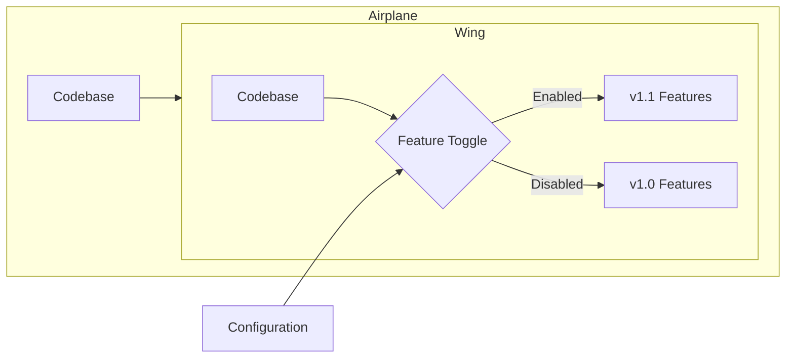
**Dependencies**
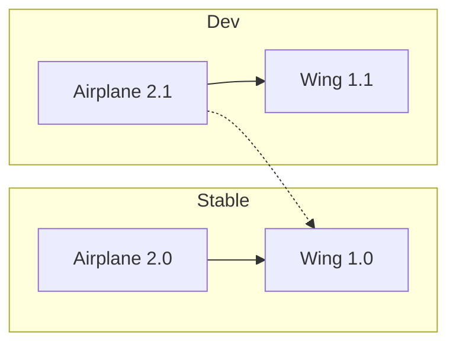
*   **Explanation:**
*   The `Feature Toggle` in Wing determines which code path is executed.
*   The `Configuration` (external to the code) controls the toggle's state.
*   Airplane simply uses Wing, unaware of the internal toggle.
* The dotted line shows that Airplane *can* work with 1.0.

**2. Branching (Gitflow, or similar)**

*   **Concept:**  Use a branching strategy in your version control system (like Git).  Maintain a `main` (or `master`) branch for stable releases and a `develop` branch for ongoing development.  Feature branches are created off `develop` for specific new features in Wing. When releasing:
    1. Wing gets a new release from the main branch
    2. The dev wing branch get merged into the main branch
    3. Wing gets a new release from the main branch
    4. Airplane gets a new release

*   **Pros:**
    *   Clear separation of stable and development code.
    *   Well-established workflow (Gitflow is a common pattern).
    *   Allows for parallel development on multiple features.

*   **Cons:**
    *   Can lead to merge conflicts if multiple developers are working on related features.
    *   Requires careful coordination of releases.
    *   `develop` branch can become unstable if not managed carefully.
    *  Doesn't solve the *runtime* dependency issue of Airplane needing to work with both Wing versions.  This is primarily a *code management* strategy. You'd likely *combine* this with Feature Toggles (Option 1) or Versioned APIs (Option 3).

*   **Mermaid Diagram (Simplified Gitflow):**

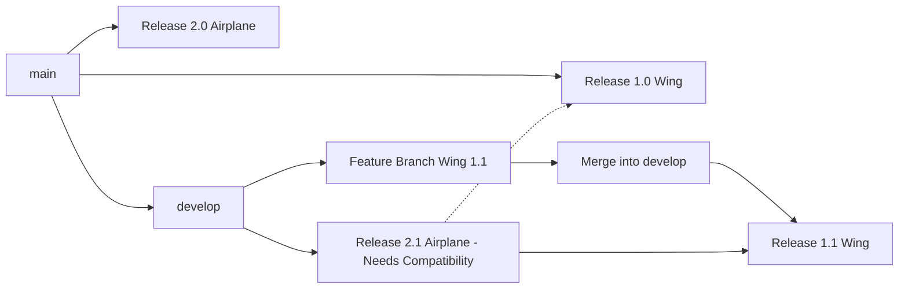
**Dependencies**

*   **Explanation:**
*   `main` branch holds stable, released code.
*   `develop` is the integration branch for new features.
*   Feature branches isolate changes.
*   The dotted line shows that 2.1 needs to maintain compatibility.

**3. Versioned API (Backward Compatibility)**

*   **Concept:**  Treat the interface between Wing and Airplane as a formal API.  When introducing changes in Wing v1.1, ensure backward compatibility:
    *   **Option A (Additive Changes):**  Only *add* new functions/methods/endpoints to the API.  Don't modify or remove existing ones. Airplane 2.0 can continue to use the old API, while Airplane (Dev) can start using the new parts.
    *   **Option B (Versioning):**  Explicitly version your API (e.g., `/v1/wing`, `/v2/wing`).  Airplane 2.0 uses `/v1/wing`, and Airplane (Dev) can choose to use `/v2/wing`.  You might need to maintain both API versions for a period.

*   **Pros:**
    *   Cleanest approach for long-term maintainability.
    *   Explicitly defines the contract between components.
    *   Allows for independent evolution of Wing and Airplane.

*   **Cons:**
    *   Requires more upfront design and planning.
    *   Can lead to code duplication if you need to maintain multiple API versions.
    *   More complex than feature toggles for simple changes.

*   **Mermaid Diagram (Option B - Versioned Endpoints):**

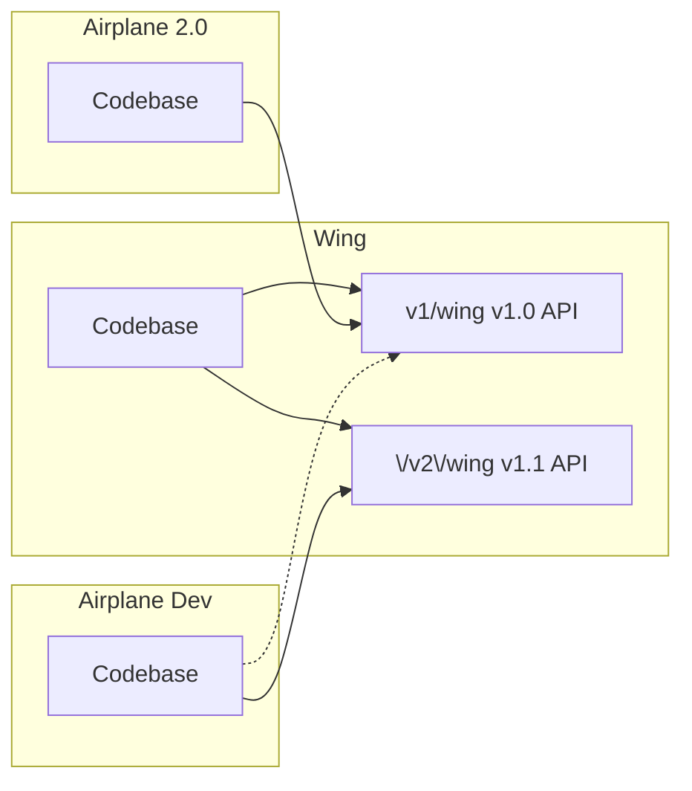
**Dependencies**
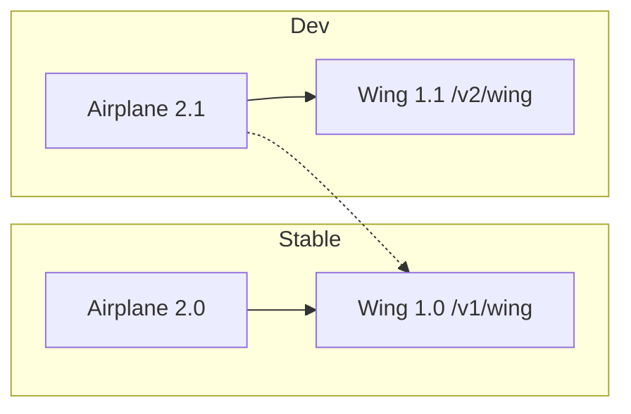

*   **Explanation:**
*   Wing exposes two different API endpoints, one for each version.
*   Airplane 2.0 uses the v1 API.
*   Airplane (Dev) can use the v2 API, or the v1 (dotted).

**4. Dependency Injection (Inversion of Control)**

*   **Concept:**  Airplane doesn't directly depend on a *concrete* implementation of Wing. Instead, it depends on an *abstraction* (an interface or abstract class). You can then "inject" either the stable Wing implementation or the dev Wing implementation into Airplane at runtime.
* **Pros:**
    *   Very flexible.  Easy to switch between different implementations.
    *   Promotes loose coupling between components.
    *   Excellent for testing (you can inject mock implementations).
*   **Cons:**
    *   Requires a dependency injection framework (or manual implementation).
    *   Adds a layer of indirection, which can make the code slightly harder to follow initially.

*   **Mermaid Diagram:**

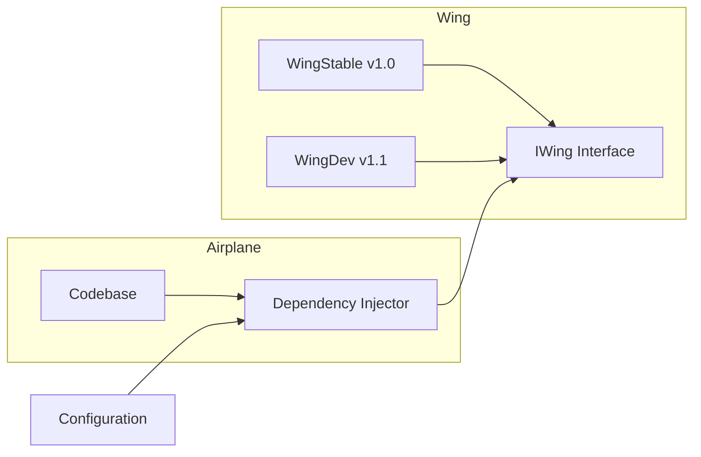
**Dependencies**
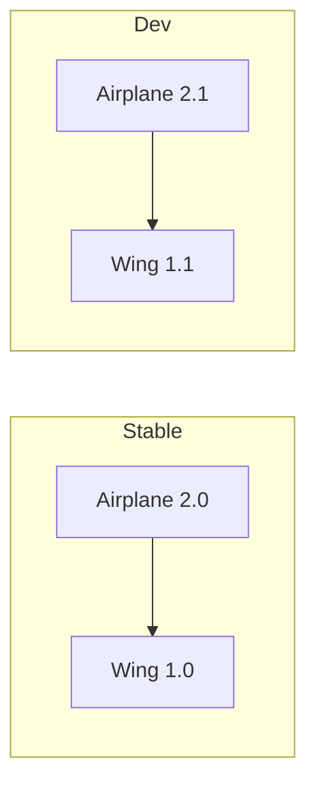

*   **Explanation:**
*   `IWing` is an interface that defines the contract.
*   `WingStable` and `WingDev` are concrete implementations.
*   The `Dependency Injector` (controlled by `Configuration`) provides the correct implementation to Airplane.
    * Airplane Dev and Stable can use the same interface, the code is identical

**5. Microservices (Extreme Versioning)**

*   **Concept:**  Treat Wing and Airplane as completely separate services, potentially deployed independently.  Each service has its own versioning and release cycle.  This is a more drastic approach, suitable for large, complex systems.
* **Pros:**  Highest degree of independence, scalability.
* **Cons:**  Significant overhead in terms of infrastructure, deployment, and inter-service communication.

*   **Mermaid Diagram (Simplified):**

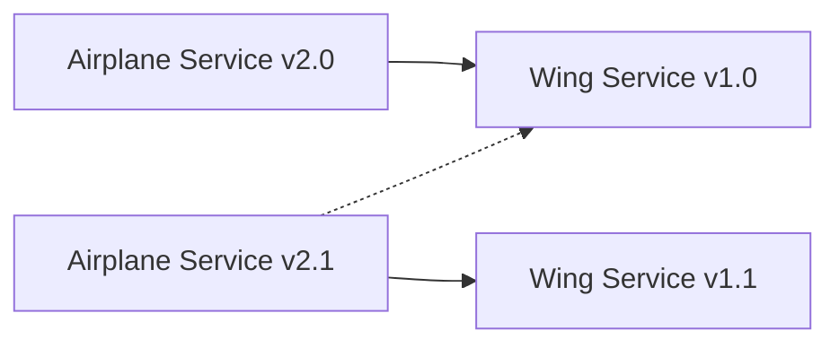
**Dependencies**

**Choosing the Right Approach:**

The best strategy depends on factors like:

*   **Complexity of the changes:**  For small, isolated changes, Feature Toggles are often sufficient.  For larger, architectural changes, Versioned APIs or Dependency Injection might be better.
*   **Team size and organization:**  Branching strategies work well for larger teams with clear roles.
*   **Release cadence:**  If you need to release frequently, Feature Toggles can help with continuous delivery.
*   **Long-term maintainability:**  Versioned APIs and Dependency Injection promote cleaner code in the long run.
*   **Infrastructure:** Microservices have higher infrastructure requirements.

**Recommendation:**

For your scenario, a combination of **Feature Toggles (Option 1) and Branching (Option 2)** is likely the most practical starting point:

1.  **Branching:**  Use a branching strategy (like Gitflow) to manage the code for Wing 1.0 (stable) and Wing 1.1 (dev).
2.  **Feature Toggles:**  Within the Wing codebase, use feature toggles to control the activation of the new v1.1 features.
3.  **Release:** Release Wing 1.1 *with* the toggles. The default configuration should have the toggles *off* (using the stable v1.0 behavior).
4.  **Airplane (Dev):**  When building and testing Airplane (Dev), configure the Wing feature toggles to be *on* to test the new functionality.  You can use environment variables or a configuration file for this.
5. **Airplane Stable:** Use a stable wing version

This approach gives you the flexibility of continuous development and testing while maintaining backward compatibility for stable users. As your system grows, you might consider transitioning to Versioned APIs or Dependency Injection for a more robust solution.

# Flash
This is a classic scenario in software development, especially when dealing with dependencies and the need to iterate quickly without disrupting stable production environments. Here are several options to manage this situation, along with Mermaid diagrams to visualize them:

## Options for Managing Stable and Dev Functionality

Here are a few strategies, ranging from simpler to more complex, with their pros and cons:

**1. Branching and Versioning (Git-flow inspired)**

* **Concept:**  Use branching in your version control system (like Git) to isolate `dev` work.  Release versions of `wing` and `airplane` with clear version numbers. `airplane` can specify a dependency range for `wing`.

* **Workflow:**
    1. **Stable Branch:** `stable` team works on the `main` or `stable` branch of both `wing` and `airplane`. Releases are made from this branch.
    2. **Development Branch:** `dev` team creates a `develop` or feature branch (`dev-wing`) from `stable` for `wing`. They implement the new functionality here.
    3. **Merge and Release Wing:** Once `dev-wing` is ready and tested (ideally with automated tests), it's merged back into `develop`. A new version of `wing` (e.g., `wing v2.0.0`) is released from `develop` or a dedicated release branch.
    4. **Update Airplane Dependency:** `dev` team updates the `airplane` project's dependency to use the new `wing` version (e.g., `wing >= v1.0.0, < v3.0.0` or specifically `wing v2.0.0`).
    5. **Test Airplane with New Wing:** Thoroughly test `airplane` with the new `wing` version.
    6. **Release Airplane:**  Once `airplane` is tested and stable with the new `wing`, release a new version of `airplane` (e.g., `airplane v2.0.0`).

* **Mermaid Diagram (Branching and Dependencies):**

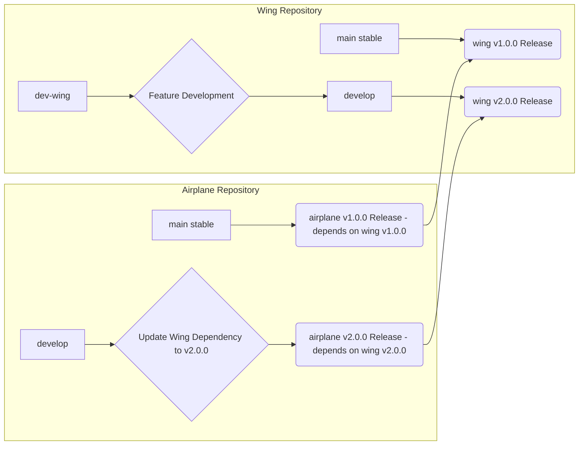

* **Pros:**
    * **Clear Separation of Work:** Branches naturally isolate `dev` and `stable` work.
    * **Version Control:**  Versioning provides traceability and allows for rollbacks.
    * **Standard Practice:** Widely used and understood in software development.
    * **Dependency Management:**  Standard dependency management tools can handle version specifications.

* **Cons:**
    * **Merge Conflicts:** Merging branches can sometimes be complex and lead to conflicts.
    * **Integration Testing:** Requires careful integration testing to ensure compatibility between versions.
    * **Not Runtime Switching:** This approach doesn't inherently allow for runtime switching between stable and dev functionality within the *same* deployed instance.

**2. Feature Flags/Toggles**

* **Concept:** Introduce feature flags or toggles within the `wing` codebase to enable/disable the new development functionality.  `airplane` (or configuration) can then control these flags at runtime.

* **Workflow:**
    1. **Develop with Flags:** `dev` team develops the new functionality in `wing` and wraps it within feature flags (e.g., `if (isFeatureEnabled("newWingFeature")) { ... new code ... } else { ... old code ...}`).
    2. **Release Wing with Flags:** Release a new version of `wing` (e.g., `wing v2.0.0`) containing the code with feature flags.
    3. **Configure Airplane:** `airplane` (or its environment configuration) is set up to control the feature flags in `wing`. Initially, it might disable the new feature for stable environments and enable it for dev/testing environments.
    4. **Release Airplane:** Release a new version of `airplane` (e.g., `airplane v2.0.0`) that works with the flag-enabled `wing`.
    5. **Runtime Switching:** By changing the configuration (e.g., environment variables, database settings) of `airplane`, you can dynamically switch between the old and new `wing` functionality without redeploying `wing` itself.

* **Mermaid Diagram (Feature Flags):**

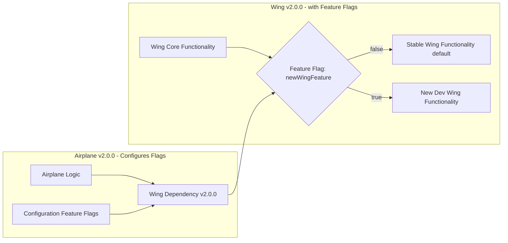

* **Pros:**
    * **Runtime Switching:** Enables dynamic switching between stable and dev functionality without redeployments.
    * **Gradual Rollout:** Allows for controlled rollout of new features to specific environments or user groups.
    * **Reduced Risk:**  Easier to rollback to stable functionality if issues arise.
    * **Decoupling Release and Feature Enablement:**  You can release code changes more frequently and enable features separately.

* **Cons:**
    * **Code Complexity:**  Feature flags can increase code complexity if not managed well (feature flag debt).
    * **Testing Complexity:** Need to test both paths (with and without the feature enabled).
    * **Configuration Management:** Requires a robust configuration management system to control flags.

**3.  Interface/Abstraction with Multiple Implementations**

* **Concept:** Define an interface or abstraction for the wing functionality that `airplane` depends on. Create two implementations of this interface: one for the stable functionality and one for the new dev functionality.  `airplane` can be configured to use either implementation at runtime.

* **Workflow:**
    1. **Define Interface:** Create an interface (e.g., `IWingFunctionality`) in `wing` that defines the required operations.
    2. **Stable Implementation:** Implement `IWingFunctionality` as `StableWingFunctionality` (representing the stable behavior).
    3. **Dev Implementation:** Implement `IWingFunctionality` as `DevWingFunctionality` (representing the new development behavior).
    4. **Configuration in Airplane:** `airplane` is configured (e.g., through dependency injection, factory pattern, or configuration files) to choose which implementation of `IWingFunctionality` to use.
    5. **Release Wing with Both Implementations:** Release a new version of `wing` (e.g., `wing v2.0.0`) containing both `StableWingFunctionality` and `DevWingFunctionality`.
    6. **Release Airplane with Configuration:** Release a new version of `airplane` (e.g., `airplane v2.0.0`) that can be configured to use either implementation.
    7. **Runtime Selection:** At runtime, `airplane` selects the desired `IWingFunctionality` implementation based on its configuration.

* **Mermaid Diagram (Interface/Abstraction):**

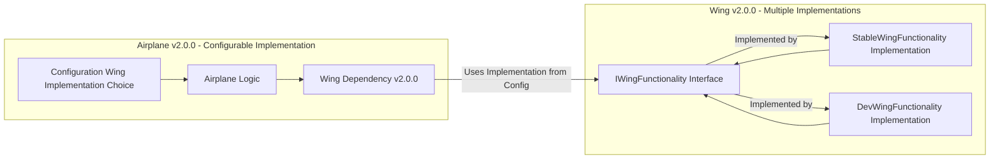

* **Pros:**
    * **Clean Separation of Concerns:**  Clearly separates the interface from its implementations.
    * **Testability:**  Easier to test different implementations independently.
    * **Runtime Flexibility:**  Allows for runtime switching by changing configuration.
    * **Maintainability:**  Can improve code maintainability by isolating different versions of functionality.

* **Cons:**
    * **Design Complexity:** Requires upfront design to define the interface and implementations.
    * **Increased Code Volume:**  You have multiple implementations of the same functionality.
    * **Potential for Misuse:**  Need to ensure that the interface is well-defined and that implementations adhere to it.

**4. Microservices/Modular Architecture (More Advanced)**

* **Concept:** If `wing` is a large or complex component, you could consider breaking it into microservices or modules. You could then deploy separate instances of `wing` – one with the stable functionality (e.g., `wing-stable-service`) and one with the dev functionality (e.g., `wing-dev-service`). `airplane` could then be configured to communicate with either service.

* **Workflow (Simplified):**
    1. **Modularize Wing:**  Structure `wing` as a deployable service or module.
    2. **Deploy Stable Wing Service:** Deploy a stable version of `wing` as `wing-stable-service`.
    3. **Deploy Dev Wing Service:** Deploy the new development version of `wing` as `wing-dev-service`.
    4. **Configure Airplane to Choose Service:**  `airplane` is configured to point to either `wing-stable-service` or `wing-dev-service` (e.g., through service discovery, environment variables, or routing).
    5. **Release Airplane with Service Configuration:** Release a new version of `airplane` that can be configured to use either wing service.

* **Mermaid Diagram (Microservices/Modular):**

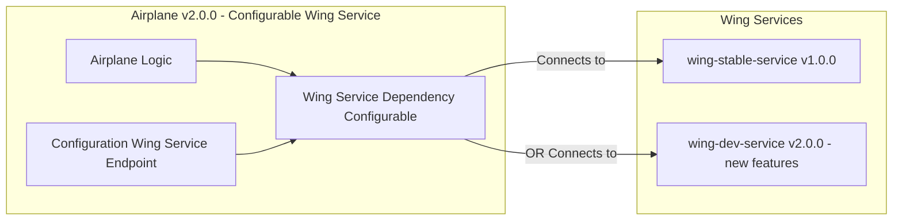

* **Pros:**
    * **Strong Isolation:**  Services are completely isolated, reducing the risk of interference.
    * **Independent Deployments:**  Each service can be deployed and scaled independently.
    * **Technology Diversity:**  Potentially allows for using different technologies for different services.
    * **Clear Boundaries:**  Enforces clear boundaries between components.

* **Cons:**
    * **Architectural Complexity:**  Microservices architecture is more complex to set up and manage.
    * **Increased Operational Overhead:**  More services to deploy, monitor, and maintain.
    * **Communication Overhead:**  Communication between services (network calls) can add overhead.
    * **Potentially Overkill:**  Might be too complex for simpler dependency scenarios.

**Choosing the Right Option:**

The best option depends on factors like:

* **Complexity of `wing` and `airplane`:** For simpler projects, branching/versioning or feature flags might be sufficient. For more complex systems, interfaces/abstractions or microservices might be more appropriate.
* **Frequency of releases:** If you release very frequently, feature flags or runtime switching mechanisms can be beneficial.
* **Team structure and skills:**  Microservices require more specialized skills and infrastructure.
* **Performance requirements:**  Consider the performance implications of each approach.

For your scenario, starting with **Branching and Versioning** combined with **Feature Flags** within `wing` is often a good and practical approach.  Branching manages the development lifecycle, versioning tracks changes, and feature flags provide the runtime flexibility to switch between stable and dev functionality as needed.  If `wing` becomes very large or complex, you might consider moving towards interfaces/abstractions or even a microservices approach later.

# Deep

To manage dependencies between the `wing` and `airplane` components while maintaining both stable and dev functionality, here are key strategies with visualizations:

---

### **1. Feature Toggles**  
**Description**: Use a configuration-driven toggle to switch between stable and dev functionality in `wing`.  
**Mermaid Diagram**:
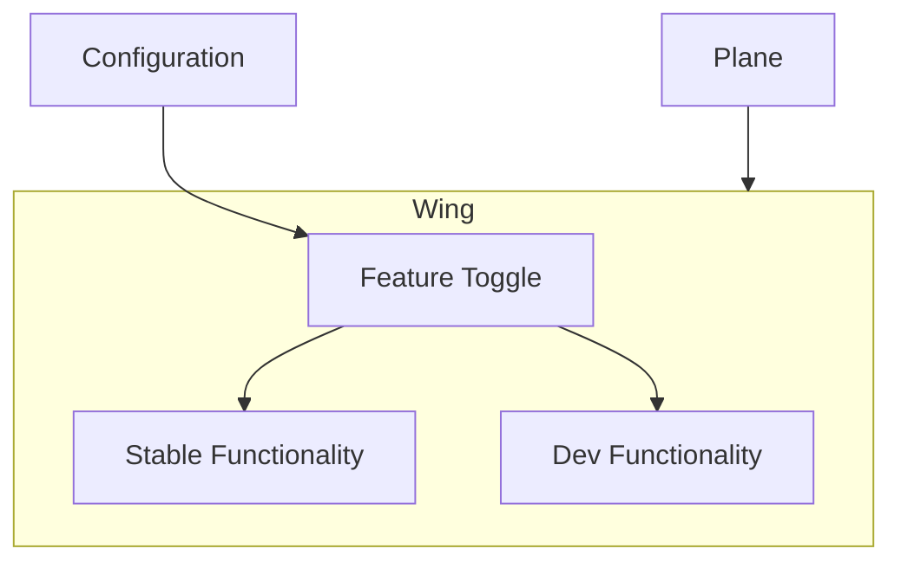
- **Pros**: Simple, avoids version duplication.  
- **Cons**: Toggle complexity increases over time.

---

### **2. API Versioning**  
**Description**: Support multiple API versions in `wing`, allowing `plane` to use either.  
**Mermaid Diagram**:
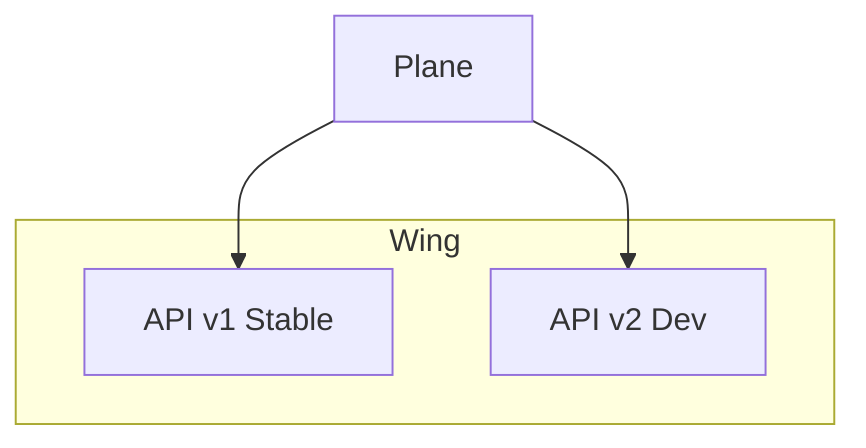
- **Pros**: Clear separation of versions.  
- **Cons**: Requires maintaining multiple APIs.

---

### **3. Dependency Injection**  
**Description**: Inject the desired `wing` implementation (stable/dev) into `plane` at runtime.  
**Mermaid Diagram**:
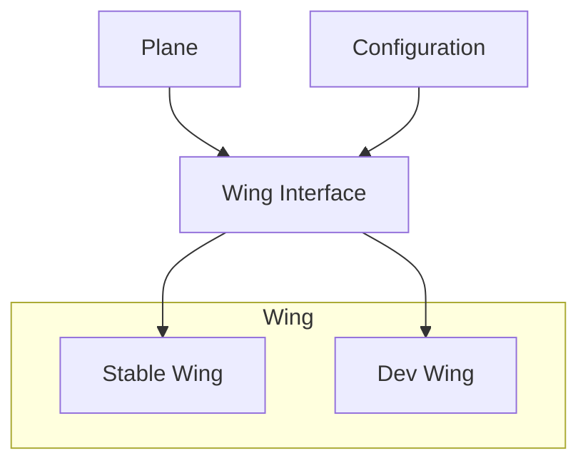
- **Pros**: Decouples components.  
- **Cons**: Adds abstraction overhead.

---

### **4. Semantic Versioning**  
**Description**: Release `wing` with backward-compatible changes (e.g., `v1.0` → `v1.1`).  
**Mermaid Diagram**:
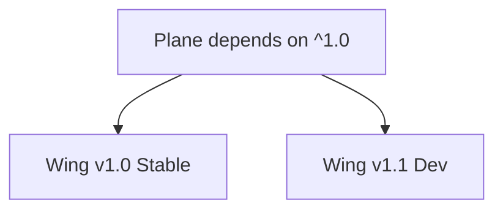
- **Pros**: Simple if changes are non-breaking.  
- **Cons**: Breaks if backward compatibility is lost.

---

### **5. Branch by Abstraction**  
**Description**: Introduce an abstraction layer between `plane` and `wing`.  
**Mermaid Diagram**:
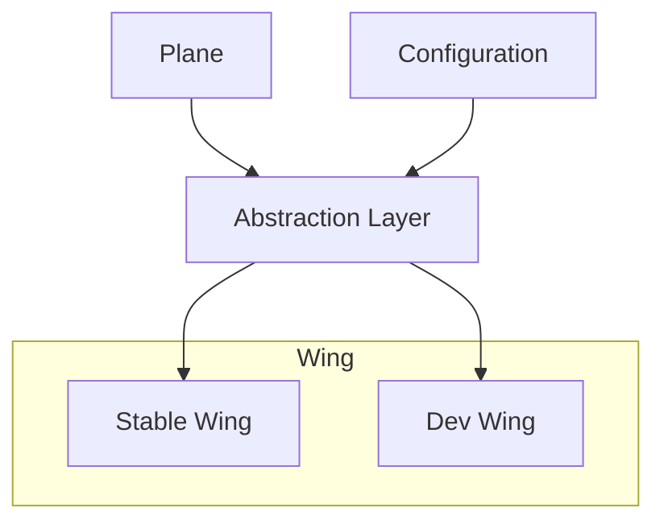
- **Pros**: Future-proof and flexible.  
- **Cons**: Requires upfront design effort.

---

### **Recommendation**  
- Use **feature toggles** for short-term changes or gradual rollouts.  
- Use **API versioning** or **abstraction layers** for long-term compatibility.  
- Ensure **semantic versioning** to communicate breaking changes clearly.  

Let me know if you’d like to explore a specific strategy in more detail!

---

