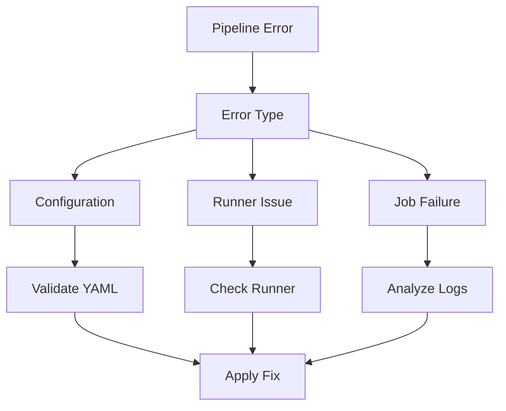

# Pipeline Debugging Guide

## Overview

This guide provides comprehensive troubleshooting strategies for GitLab CI/CD pipeline issues, including job failures, runner problems, and pipeline configuration errors.

## Pipeline Diagnostics



## Configuration Issues

### YAML Validation

```bash
# Local validation
gitlab-ci-lint

# API validation
curl --header "PRIVATE-TOKEN: $TOKEN" \
     "https://gitlab.com/api/v4/projects/$ID/ci/lint" \
     --form "content=@.gitlab-ci.yml"
```

### Common Configuration Errors

| Error | Cause | Solution |
|-------|-------|----------|
| YAML syntax | Invalid format | Check YAML syntax |
| Unknown keyword | Invalid directive | Check GitLab CI reference |
| Invalid reference | Missing template | Verify include paths |

### Debug Configuration
```yaml
# Debug job configuration
job_name:
  variables:
    CI_DEBUG_TRACE: "true"
  before_script:
    - set -x
    - env | sort
```

## Runner Problems

### Runner Diagnostics

```bash
# Check runner status
gitlab-runner verify

# Runner logs
gitlab-runner --debug run

# Test runner
gitlab-runner exec docker job_name
```

### Common Runner Issues

| Issue | Symptom | Solution |
|-------|---------|----------|
| Not connected | `stuck` status | Check runner connection |
| Wrong executor | Job fails to start | Verify executor config |
| Resource limits | Job terminated | Adjust resource limits |

### Runner Debug Examples
```yaml
# Debug runner configuration
.runner_debug:
  variables:
    FF_DEBUG_JOB: "true"
  tags:
    - debug
```

## Job Failures

### Job Debugging

```yaml
job_debug:
  script:
    - set -x  # Enable command tracing
    - export
    - pwd
    - ls -la
```

### Common Job Issues

| Issue | Symptom | Solution |
|-------|---------|----------|
| Script error | Non-zero exit | Check script syntax |
| Missing dep | Command not found | Install dependencies |
| Timeout | Job exceeded limit | Adjust timeout or optimize |

### Job Debug Tools
```bash
# Debug shell scripts
bash -x script.sh

# Check environment
env | sort

# Monitor resources
top -b -n 1
```

## Cache Problems

### Cache Debugging

```yaml
# Debug cache configuration
cache_debug:
  cache:
    key: ${CI_COMMIT_REF_SLUG}
    paths:
      - path/to/cache
  before_script:
    - ls -la path/to/cache
```

### Common Cache Issues

| Issue | Symptom | Solution |
|-------|---------|----------|
| Cache miss | Missing files | Verify cache key |
| Upload fails | Cache error | Check permissions |
| Space issues | No space left | Clean cache |

### Cache Analysis
```bash
# Check cache size
du -sh path/to/cache

# List cache contents
find path/to/cache -type f

# Clear cache
rm -rf path/to/cache/*
```

## Artifact Problems

### Artifact Debugging

```yaml
# Debug artifact configuration
artifact_debug:
  artifacts:
    paths:
      - path/to/artifact
    expire_in: 1 week
  before_script:
    - ls -la path/to/artifact
```

### Common Artifact Issues

| Issue | Symptom | Solution |
|-------|---------|----------|
| Missing files | Artifact not found | Check paths |
| Size limit | Too large | Adjust size or compress |
| Expiry | Not available | Check retention policy |

### Artifact Management
```bash
# Check artifact size
du -sh path/to/artifact

# Compress artifacts
tar czf artifact.tar.gz path/to/artifact

# Clean old artifacts
find . -name "*.artifact" -mtime +7 -delete
```

## Environment Issues

### Environment Debugging

```yaml
# Debug environment variables
env_debug:
  script:
    - env | sort
    - printenv CI_*
    - echo $PATH
```

### Common Environment Issues

| Issue | Symptom | Solution |
|-------|---------|----------|
| Missing var | Undefined variable | Set variable |
| Wrong value | Unexpected behavior | Check variable value |
| Scope issue | Not available | Check variable scope |

### Environment Validation
```yaml
# Validate environment setup
validate_env:
  script:
    - test -n "$REQUIRED_VAR" || exit 1
    - echo "Variable present: $REQUIRED_VAR"
```

## Docker Issues

### Docker Debugging

```yaml
# Debug Docker configuration
docker_debug:
  image: docker:latest
  services:
    - docker:dind
  variables:
    DOCKER_TLS_CERTDIR: ""
  script:
    - docker info
    - docker ps
```

### Common Docker Issues

| Issue | Symptom | Solution |
|-------|---------|----------|
| Auth failure | Pull error | Check registry auth |
| Network issue | Connection failed | Check network config |
| Storage issue | No space left | Clean Docker system |

### Docker Inspection
```bash
# Check Docker status
docker info

# List images
docker images

# Check space usage
docker system df
```

## Pipeline Performance

### Performance Analysis

```yaml
# Monitor job performance
performance_debug:
  script:
    - time command
    - ps aux
    - iostat -x 1 5
```

### Common Performance Issues

| Issue | Symptom | Solution |
|-------|---------|----------|
| Slow jobs | Long duration | Optimize steps |
| High load | Resource limit | Adjust resources |
| I/O bottleneck | Disk wait | Optimize I/O |

### Performance Monitoring
```bash
# Check system load
uptime

# Monitor processes
top -b -n 1

# Check I/O
iostat -x
```

## Advanced Debugging

### Debug Tools

```yaml
# Comprehensive debug job
full_debug:
  variables:
    CI_DEBUG_TRACE: "true"
    FF_DEBUG_JOB: "true"
  before_script:
    - set -x
    - env | sort
    - df -h
    - free -m
  script:
    - strace command
    - ltrace program
    - gdb --batch --ex "run" --ex "bt" ./program
```

### System Analysis
```bash
# System calls
strace -f command

# Library calls
ltrace ./program

# Process tree
pstree -p $$
```

## See Also

- [Common Issues](common-issues.md)
- [Build Problems](build-problems.md)
- [CI/CD Pipeline Overview](../ci-cd/pipeline-overview.md)
