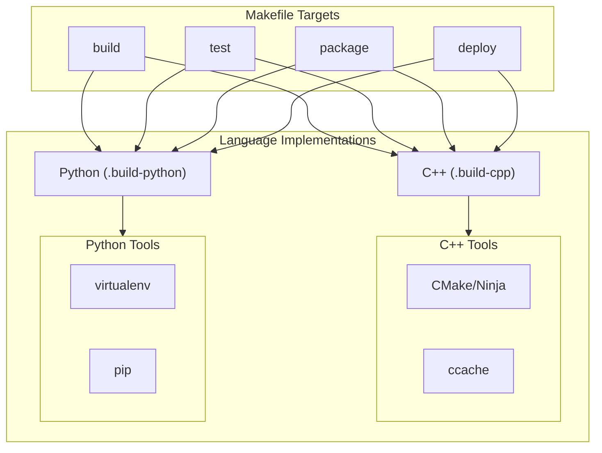
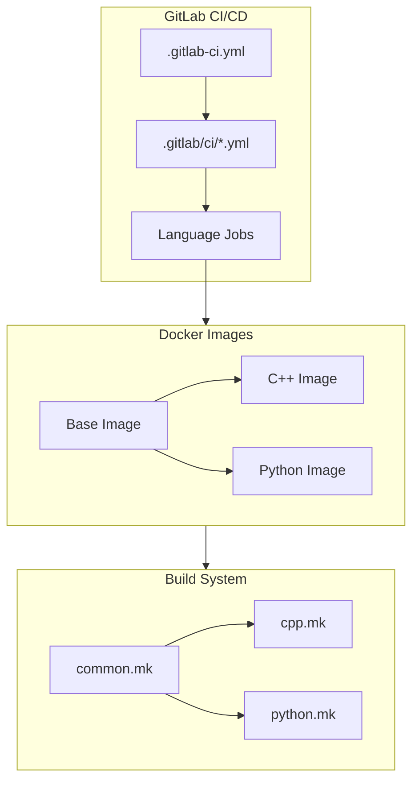
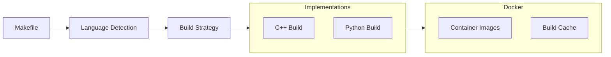

# System Patterns

## Core Architecture

### Pipeline Architecture


### Component Architecture


## Key Technical Decisions

### Build System Implementation
1. **Modular Makefiles**
   ```mermaid
   flowchart TD
       M["Makefile"]
       C["common.mk"]
       CPP["cpp.mk"]
       PY["python.mk"]
       
       M --> C
       C --> CPP & PY
       
       subgraph Targets["Standard Targets"]
           B["build"]
           T["test"]
           P["package"]
           D["deploy"]
       end
       
       M --> Targets
   ```

2. **Docker Structure**
   ```mermaid
   flowchart TD
       Base["debian:bullseye-slim"]
       Common["Base Image"]
       CPP["C++ Image"]
       PY["Python Image"]
       
       Base --> Common
       Common --> CPP & PY
       
       subgraph Tools["Common Tools"]
           Git["git"]
           Make["make"]
           Curl["curl"]
       end
       
       Common --> Tools
   ```

### Pipeline Design
1. **Template Structure**
   ```mermaid
   flowchart LR
       Base["base.gitlab-ci.yml"]
       CPP["cpp.gitlab-ci.yml"]
       PY["python.gitlab-ci.yml"]
       Main[".gitlab-ci.yml"]
       
       Base --> CPP & PY
       CPP & PY --> Main
   ```

2. **Job Organization**
   ```mermaid
   flowchart TD
       Pre["Pre Stage"]
       Build["Build Stage"]
       Test["Test Stage"]
       Package["Package Stage"]
       Deploy["Deploy Stage"]
       
       Pre --> Build
       Build --> Test
       Test --> Package
       Package --> Deploy
       
       subgraph Parallel["Parallel Execution"]
           CPP["C++ Jobs"]
           PY["Python Jobs"]
       end
       
       Build --> Parallel
   ```

## Design Patterns

### Factory Pattern (Build System)
- Makefile as abstract factory
- Language-specific makefiles as concrete factories
- Standardized target interface
- Dynamic implementation selection

### Builder Pattern (Docker)
- Base image as foundation
- Staged construction for each language
- Common utilities in base
- Language-specific tools added progressively

### Template Method Pattern (CI/CD)
- Base CI configuration defines workflow
- Language-specific configurations implement details
- Common job templates
- Standardized stage progression

### Strategy Pattern (Build Process)
- Common build interface
- Language-specific build strategies
- Runtime selection based on project type
- Configurable build options

## Component Relationships

### Build System Integration


### CI/CD Flow
```mermaid
flowchart LR
    Trigger["Pipeline Trigger"] --> Pre["Docker Builds"]
    Pre --> Build["Language Builds"]
    Build --> Test["Parallel Tests"]
    Test --> Package["Packaging"]
    Package --> Deploy["Deployment"]
    
    subgraph Cache["Caching"]
        DC["Docker Layers"]
        BC["Build Artifacts"]
        TC["Test Results"]
    end
    
    Build --> Cache
    Test --> Cache
