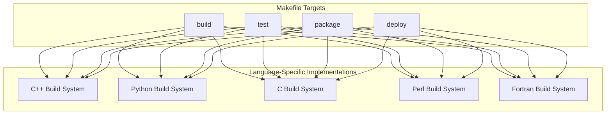
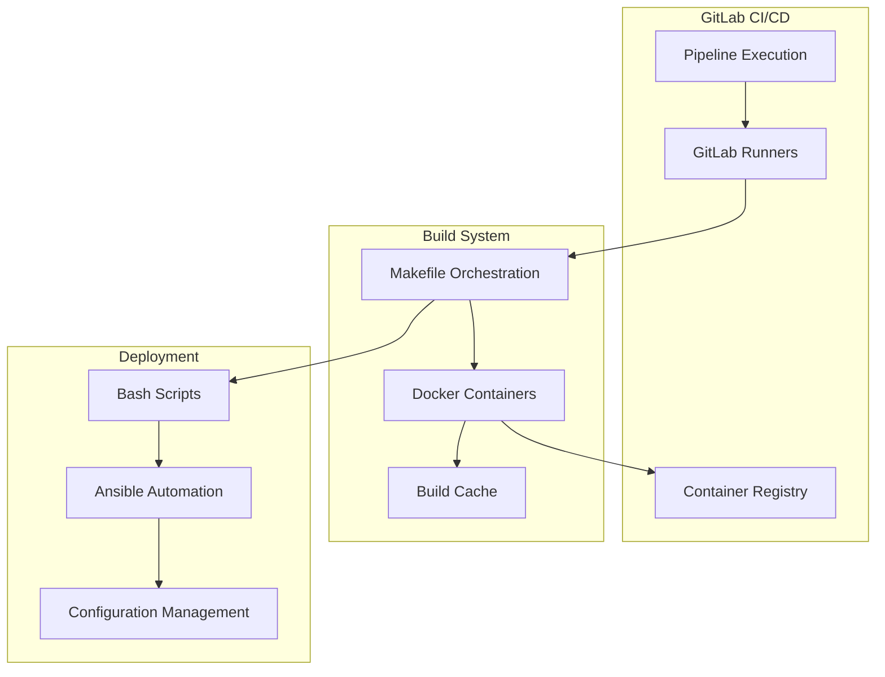
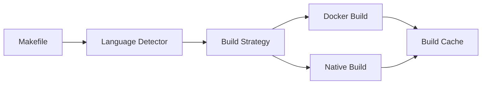

# System Patterns

## Core Architecture

### Pipeline Architecture


### Component Architecture


## Key Technical Decisions

### Build System
1. **Language-Agnostic Interface**
   - Unified Makefile targets abstract away language-specific details
   - Standard targets: build, test, package, deploy
   - Consistent interface across all language implementations

2. **Containerized Execution**
   - Docker-based build environments
   - Reproducible builds across platforms
   - Isolated dependencies per language

3. **Cache Management**
   - Optimized layer caching for Docker builds
   - Artifact caching in GitLab CI
   - Dependencies caching per language

### Pipeline Design
1. **Modular Structure**
   - Template-based pipeline definitions
   - Reusable job configurations
   - Environment-specific overrides

2. **Testing Strategy**
   - Language-specific test runners
   - Unified test reporting
   - Coverage tracking

3. **Deployment Process**
   - Environment-based deployment stages
   - Ansible-driven configuration
   - Automated rollback capabilities

## Design Patterns

### Factory Pattern
- Language-specific build implementations behind common interface
- Makefile targets as the factory interface
- Specific build systems as concrete implementations

### Strategy Pattern
- Swappable build strategies per language
- Common build interface
- Runtime selection based on project type

### Observer Pattern
- Pipeline status notifications
- Build event monitoring
- Deployment status tracking

### Facade Pattern
- Makefile as simplified interface
- Complex build operations hidden
- Unified command structure

## Component Relationships

### Build System Integration


### Deployment Flow
```mermaid
flowchart LR
    CI[GitLab CI] --> Make[Makefile]
    Make --> Build[Build]
    Build --> Test[Test]
    Test --> Package[Package]
    Package --> Deploy[Deploy]
    Deploy --> Ansible[Ansible]
    Ansible --> Config[Configuration]
