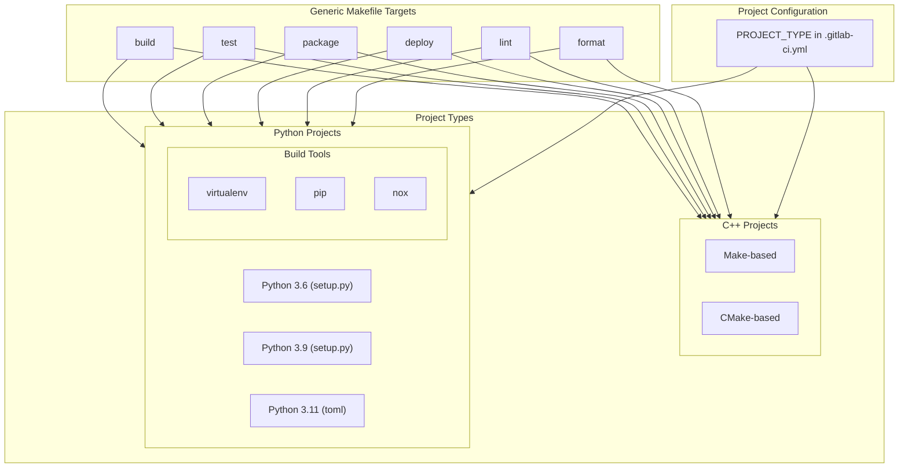
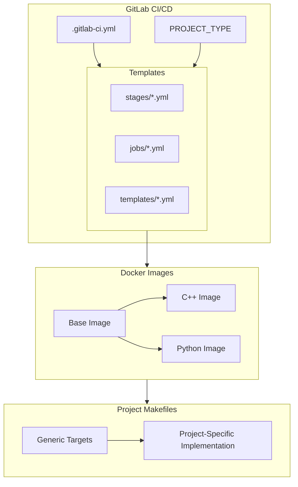
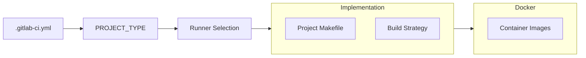

# System Patterns

## Core Architecture

### Pipeline Architecture


### Component Architecture


## Key Technical Decisions

### Build System Implementation
1. **Project Makefiles**
   ```mermaid
   flowchart TD
       subgraph Project["Project Repository"]
           M["Makefile"]
           I["Implementation"]
       end
       
       subgraph Targets["Generic Targets"]
           B["build"]
           T["test"]
           P["package"]
           D["deploy"]
           L["lint"]
           F["format"]
           H["help"]
       end
       
       M --> I
       I --> Targets
       
       subgraph Type["Project Type"]
           V["PROJECT_TYPE in .gitlab-ci.yml"]
           R["Runner Selection"]
       end
       
       V --> R
       R --> I
   ```

2. **Docker Structure**
   ```mermaid
   flowchart TD
       Base["debian:bullseye-slim"]
       Common["Base Image"]
       CPP["C++ Image"]
       PY["Python Image"]
       
       Base --> Common
       Common --> CPP & PY
       
       subgraph Tools["Common Tools"]
           Git["git"]
           Make["make"]
           Curl["curl"]
       end
       
       Common --> Tools
   ```

### Pipeline Design
1. **Stage-Based Structure**
   ```mermaid
   flowchart TD
       Base[".gitlab/ci/templates/default.yml"]
       Stages[".gitlab/ci/stages/*.yml"]
       Jobs[".gitlab/ci/jobs/*.yml"]
       Main[".gitlab-ci.yml"]
       
       Base --> Stages & Jobs
       Stages & Jobs --> Main
       
       subgraph Stages["Stage Definitions"]
           Build["build.yml"]
           Test["test.yml"]
           Lint["lint.yml"]
           Format["format.yml"]
           Package["package.yml"]
           Deploy["deploy.yml"]
       end
       
       subgraph Jobs["Job Definitions"]
           Compile["compile.yml"]
           UnitTest["unit-tests.yml"]
           IntegTest["integration-tests.yml"]
           CodeQuality["code-quality.yml"]
           Pack["packaging.yml"]
       end
   ```

2. **Template Repository Structure**
   ```mermaid
   flowchart TD
       subgraph Templates["Template Repositories"]
           CPP["template-cpp-project"]
           PY["template-python-project"]
           
           subgraph Common["Common Structure"]
               Make["Makefile"]
               Doc["docs/"]
               Read["README.md"]
           end
           
           CPP --> Common
           PY --> Common
       end
       
       subgraph Targets["Standard Targets"]
           Build["build"]
           Test["test"]
           Package["package"]
           Deploy["deploy"]
           Lint["lint"]
           Format["format"]
           Help["help"]
       end
       
       Make --> Targets
   ```

## Design Patterns

### Factory Pattern (Build System)
- Project Makefile as concrete implementation
- Generic target interface
- Project-specific implementation
- Runner selection via PROJECT_TYPE

### Builder Pattern (Docker)
- Base image as foundation
- Staged construction for each language
- Common utilities in base
- Language-specific tools added progressively

### Template Method Pattern (CI/CD)
- Stage-based pipeline organization
- Common job templates
- Standardized stage progression
- Job-specific implementations

### Strategy Pattern (Build Process)
- Generic target interface
- Project-specific build strategies
- Build type determined by PROJECT_TYPE
- Flexible implementation options

## Component Relationships

### Build System Integration


### CI/CD Flow
```mermaid
flowchart LR
    Trigger["Pipeline Trigger"] --> Stages["Stage Execution"]
    
    subgraph Stages["Pipeline Stages"]
        Build["Build Stage"]
        Test["Test Stage"]
        Lint["Lint Stage"]
        Format["Format Stage"]
        Package["Package Stage"]
        Deploy["Deploy Stage"]
        
        Build --> Test
        Test --> Lint
        Lint --> Format
        Format --> Package
        Package --> Deploy
    end
    
    subgraph Jobs["Stage Jobs"]
        Compile["Compilation"]
        UnitTest["Unit Tests"]
        IntegTest["Integration Tests"]
        CodeQuality["Code Quality"]
        Pack["Packaging"]
    end
    
    Build --> Compile
    Test --> UnitTest & IntegTest
    Lint & Format --> CodeQuality
    Package --> Pack
