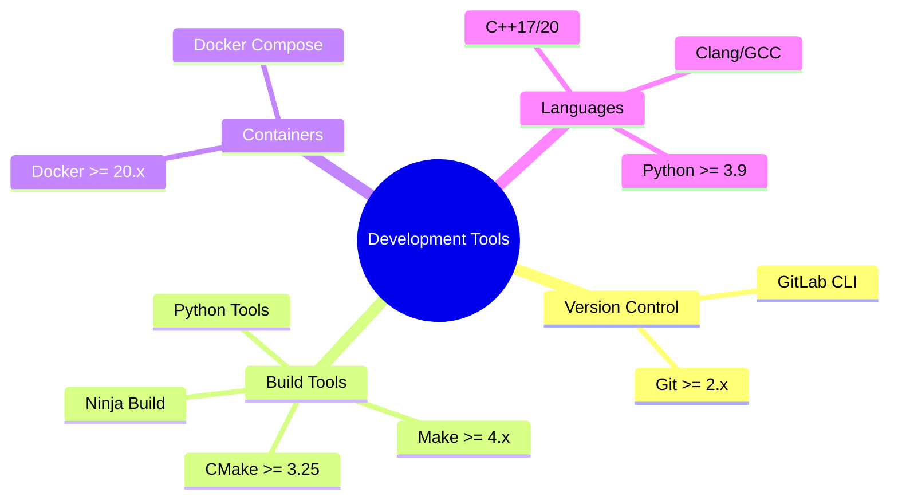

# Technical Context

## Technology Stack

### Core Technologies
1. **Version Control & CI/CD**
   - GitLab for repository management and CI/CD
   - GitLab Container Registry for image storage
   - GitLab Runners with Docker executor
   - Template-based pipeline configuration

2. **Build Systems**
   - Make for build orchestration
   - Language-specific build tools:
     - CMake for C/C++ with Ninja generator
     - setuptools/pip for Python
     - Traditional Make for C
     - Module::Build for Perl
     - FPM for Fortran

3. **Containerization**
   - Docker with multi-stage builds
   - Language-specific optimized images
   - Build cache optimization
   - Layer minimization strategies

4. **Configuration Management**
   - Modular Makefile structure
   - Environment-based configurations
   - Docker build arguments
   - GitLab CI/CD variables

5. **Build Orchestration**
   - Parallel job execution
   - Language-specific implementations
   - Standardized target interface
   - Build artifact management

## Development Setup

### Required Tools

### Environment Variables
- `CI_REGISTRY` - GitLab container registry URL
- `CI_REGISTRY_IMAGE` - Full image repository path
- `CI_PROJECT_PATH` - Project path in GitLab
- `BUILD_TYPE` - Build configuration (Debug/Release)
- `CMAKE_BUILD_TYPE` - CMake build type
- `DOCKER_REGISTRY` - Container registry URL
- `DOCKER_TAG` - Image tag (default: latest)
- `BUILD_DIR` - Build output directory
- `DIST_DIR` - Distribution artifacts directory
- `CCACHE_DIR` - Compiler cache directory
- `VIRTUAL_ENV` - Python virtual environment path
- `PYTHONPATH` - Python module search path
- `PARALLEL_JOBS` - Number of parallel jobs

## Technical Constraints

### Build System
1. **Makefile Requirements**
   - POSIX-compliant syntax
   - Support for parallel builds
   - Cross-platform compatibility
   - Clear error reporting
   - Modular include structure
   - Language-agnostic interface

2. **Container Requirements**
   - Debian-based minimal images
   - Multi-stage build optimization
   - Layer caching strategy
   - Build argument flexibility
   - Common base image
   - Health checks

3. **Pipeline Requirements**
   - Parallel job execution
   - Artifact management
   - Coverage reporting
   - Build matrices
   - Environment deployments
   - Template inheritance

### Dependencies

#### System Dependencies
- Git >= 2.x
- Docker >= 20.x
- Make >= 4.x
- Python >= 3.9
- CMake >= 3.25
- Ninja Build

#### Language Dependencies
1. **C++**
   - Modern C++ compiler (GCC/Clang)
   - CMake >= 3.25
   - Ninja build system
   - ccache
   - Boost libraries (optional)

2. **Python**
   - Python 3.9 or higher
   - virtualenv/venv
   - pip with wheel support
   - pytest for testing
   - black for formatting
   - pylint for linting

## Performance Requirements

### Build Performance
- Maximum build time: 15 minutes
- Parallel job execution
- Compiler cache utilization
- Layer cache optimization
- Resource-aware scheduling

### Pipeline Performance
- Parallel language builds
- Efficient artifact handling
- Template-based configuration
- Smart dependency management
- Fast feedback cycles

## Security Considerations

### Access Control
- Protected CI/CD variables
- Registry access control
- Runner security
- Environment isolation

### Container Security
- Minimal base images
- Regular security updates
- Layer optimization
- Multi-stage builds
- Reduced attack surface

### CI/CD Security
- Protected branches
- Secure variables
- Build isolation
- Artifact security
- Environment controls

## Monitoring & Logging

### Build Monitoring
- Job execution times
- Cache hit rates
- Resource utilization
- Error tracking
- Build success rates

### Pipeline Monitoring
- Stage completion times
- Runner performance
- Job parallelization
- Resource consumption
- Cache effectiveness
