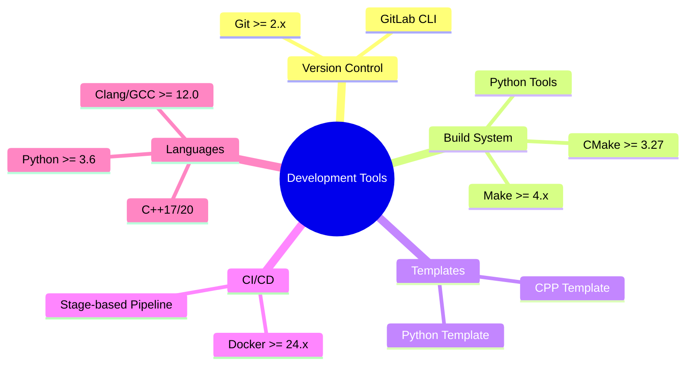

# Technical Context

## Technology Stack

### Core Technologies
1. **Version Control & CI/CD**
   - GitLab for repository management and CI/CD
   - GitLab Container Registry for image storage
   - GitLab Runners with Docker executor
   - Stage-based pipeline organization

2. **Build System**
   - Make for unified build orchestration:
     - Standard targets (build, test, package, lint, format)
     - Language-agnostic interface
     - Project-specific implementations
   - Language-specific build tools:
     - CMake for C/C++
     - setuptools/pip for Python
     - Project template repositories

3. **Containerization**
   - Docker with multi-stage builds
   - Language-specific optimized images
   - Layer minimization strategies

4. **Configuration Management**
   - Project-specific Makefiles
   - Environment-based configurations
   - Docker build arguments
   - GitLab CI/CD variables

5. **Build Orchestration**
   - Stage-based CI/CD organization
   - Standardized target interface
   - Template repositories
   - Build artifact management

## Development Setup

### Required Tools

### Environment Variables
- `CI_REGISTRY` - GitLab container registry URL
- `CI_REGISTRY_IMAGE` - Full image repository path
- `CI_PROJECT_PATH` - Project path in GitLab
- `BUILD_TYPE` - Build configuration (Debug/Release)
- `CMAKE_BUILD_TYPE` - CMake build type
- `DOCKER_REGISTRY` - Container registry URL
- `DOCKER_TAG` - Image tag (default: latest)
- `BUILD_DIR` - Build output directory
- `DIST_DIR` - Distribution artifacts directory
- `VIRTUAL_ENV` - Python virtual environment path
- `PYTHONPATH` - Python module search path
- `PARALLEL_JOBS` - Number of parallel jobs

## Technical Constraints

### Build System
1. **Makefile Requirements**
   - POSIX-compliant syntax
   - Support for parallel builds
   - Cross-platform compatibility
   - Clear error reporting
   - Project-specific implementation
   - Language-agnostic interface
   - Standardized target names

2. **Container Requirements**
   - Debian bullseye-slim base images
   - Multi-stage build optimization
   - Build argument flexibility with strong defaults
   - Common base image
   - Health checks and resource limits

3. **Pipeline Requirements**
   - Stage-based organization
   - Common job templates
   - Artifact management
   - Coverage reporting
   - Build matrices
   - Environment deployments
   - Template inheritance

### Dependencies

#### System Dependencies
- Git >= 2.40
- Docker >= 24.x
- Make >= 4.4
- Python >= 3.6
- CMake >= 3.27
- pytest >= 7.4

#### Language Dependencies
1. **C++**
   - GCC >= 12.0 or Clang >= 16.0
   - CMake >= 3.27
   - Boost libraries >= 1.83 (optional)
   - GoogleTest >= 1.14 (for testing)

2. **Python**
   - Python 3.6 or higher
   - virtualenv/venv >= 20.24
   - pip >= 23.2 with wheel support
   - pytest >= 7.4 for testing
   - black >= 23.7 for formatting
   - pylint >= 3.0 for linting
   - coverage >= 7.3 for code coverage

## Performance Requirements

### Build Performance
- Maximum build time: 15 minutes
- Parallel job execution
- Resource-aware scheduling

### Pipeline Performance
- Stage-based execution
- Efficient artifact handling
- Common job templates
- Smart dependency management
- Fast feedback cycles

## Development Process

### Access Control
- Protected CI/CD variables
- Registry access control
- Runner security
- Environment isolation

### Container Management
- Minimal base images
- Regular security updates
- Multi-stage builds
- Reduced attack surface

### CI/CD Process
- Protected branches
- Secure variables
- Build isolation
- Artifact management
- Environment controls
