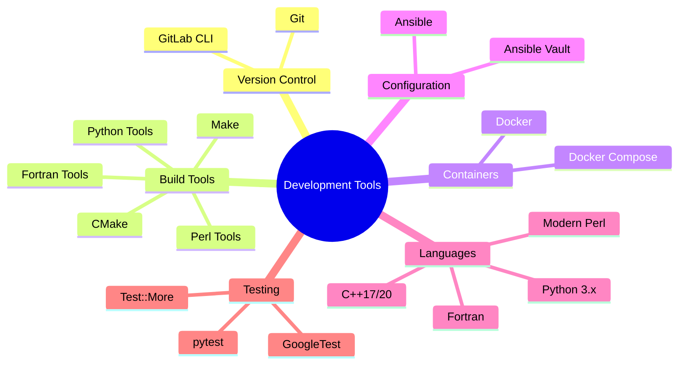

# Technical Context

## Technology Stack

### Core Technologies
1. **Version Control & CI/CD**
   - GitLab for repository management and CI/CD
   - GitLab Container Registry for image storage
   - GitLab Runners for pipeline execution

2. **Build Systems**
   - Make for build orchestration
   - Language-specific build tools:
     - CMake for C/C++
     - setuptools/pip for Python
     - Traditional Make for C
     - Module::Build for Perl
     - FPM for Fortran

3. **Containerization**
   - Docker for build environments
   - Docker Compose for local development
   - Container runtime optimization tools

4. **Configuration Management**
   - Ansible for automation
   - Ansible Vault for secrets
   - Dynamic inventory management

5. **Scripting & Automation**
   - Python for tooling and automation
   - Bash for system scripts
   - Shell utilities for operations

## Development Setup

### Required Tools

### Environment Variables
- `GITLAB_TOKEN` - GitLab API access
- `DOCKER_REGISTRY` - Container registry URL
- `ANSIBLE_VAULT_PASSWORD_FILE` - Path to vault password
- `BUILD_CACHE_DIR` - Build cache location
- `CI_ENVIRONMENT` - Current environment (dev/staging/prod)

## Technical Constraints

### Build System
1. **Makefile Requirements**
   - POSIX-compliant Makefile syntax
   - Support for parallel builds
   - Cross-platform compatibility
   - Clear error reporting

2. **Container Requirements**
   - Minimal base images
   - Layer optimization
   - Multi-stage builds
   - Build cache efficiency

3. **Pipeline Requirements**
   - Fail-fast behavior
   - Clear error reporting
   - Efficient resource usage
   - Comprehensive logging

### Dependencies

#### System Dependencies
- Git >= 2.x
- Docker >= 20.x
- Make >= 4.x
- Python >= 3.8
- Ansible >= 2.9

#### Language Dependencies
1. **C++**
   - Modern C++ compiler (GCC/Clang)
   - CMake >= 3.x
   - Boost libraries (optional)

2. **Python**
   - virtualenv/venv
   - pip
   - pytest for testing
   - black for formatting

3. **Perl**
   - Modern Perl >= 5.30
   - Module::Build
   - Test::More

4. **Fortran**
   - Modern Fortran compiler
   - FPM (Fortran Package Manager)

## Performance Requirements

### Build Performance
- Maximum build time: 15 minutes
- Parallel job execution where possible
- Efficient use of build cache
- Resource-aware job scheduling

### Pipeline Performance
- Fast feedback cycles
- Efficient use of GitLab Runners
- Optimized container lifecycle
- Smart caching strategies

## Security Considerations

### Access Control
- Principle of least privilege
- Role-based access control
- Secure credential management
- Environment isolation

### Container Security
- Regular security updates
- Image scanning
- Runtime security
- Network policies

### CI/CD Security
- Protected branches
- Secure variables
- Artifact signing
- Deployment controls

## Monitoring & Logging

### Build Monitoring
- Build time metrics
- Resource usage tracking
- Error rate monitoring
- Cache hit rates

### Pipeline Monitoring
- Job success rates
- Runner utilization
- Queue time metrics
- Environment health
